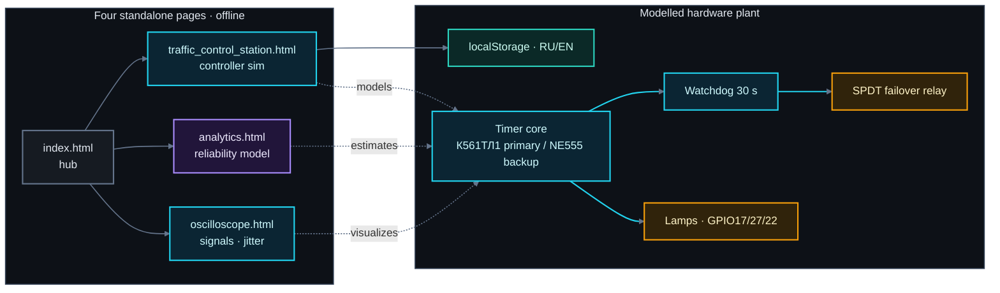

# Smart Traffic System

> **Embedded Control & Reliability Simulation**

An offline, bilingual (RU/EN), zero-dependency browser bench that simulates a
safety-redundant traffic-light controller and compares two timer technologies —
**NE555** (bipolar) and **К561ТЛ1** (CMOS "Schmitt trigger") — on reliability,
accuracy and noise immunity. Built-in simulator, reliability analytics and a live
oscilloscope, all in vanilla HTML/CSS/JS with no server.



---

## Features

- **Interactive controller** (`traffic_control_station.html`) — 60 s traffic FSM,
  manual/auto modes, `requestAnimationFrame` real-time loop, watchdog with
  `♥ pet`/failover, PIR motion extension, environment-adaptive phase timing
  (season / time-of-day / wind / precipitation / air-raid), animated PCB board +
  sensor schematic, telemetry, and a serial monitor.
- **Reliability analytics** (`analytics.html`) — stochastic stress test over
  24 h → 1 y, three harshness conditions, MTBF, false triggers, WDT false
  positives, failovers, energy, switching accuracy; KPI cards + canvas charts +
  summary table with a per-metric winner.
- **Oscilloscope** (`oscilloscope.html`) — live R/Y/G + 2 Hz clock lanes, chip
  selector showing the **50 µs (NE555) vs 5 µs (К561ТЛ1)** edge jitter, and a
  40-sweep eye diagram.
- **Bilingual** (RU/EN) with language persisted across pages via `localStorage`.

---

## Quick facts

| Fact | Value |
|---|---|
| Traffic cycle | 60 s — RED 30 → R+Y 2 → GREEN 25 → YELLOW 3 |
| Watchdog | 30 s; drains on fault → failover to NE555 |
| Supply current | 10 000 µA (NE555) vs 0.4 µA (К561ТЛ1) — ~25 000× |
| Switching accuracy | 50 µs vs 5 µs |
| Noise immunity | poor vs excellent |
| Clock | 2 Hz, 0.5 s period; jitter ±50 µs vs ±5 µs |

> Analytics figures are generated by a simulation model, not measured on real
> hardware.

---

## Run it

No install, no build, no server required:

```bash
# option A — just open the hub
start index.html          # Windows
open index.html           # macOS

# option B — serve locally (optional)
python -m http.server 8000
```

Then open `index.html` → **Power on** → try chip switch, fault injection, air-raid
and night modes; run a stress test in Analytics; flip chips in the Oscilloscope.

---

## Project layout

```
smart_traffic_system/
├── index.html                    # hub / navigation
├── traffic_control_station.html  # controller simulation (largest page)
├── analytics.html                # reliability stress test
├── oscilloscope.html             # live scope + eye diagram
├── css/
│   ├── base.css                  # shared tokens, nav, buttons, cards, tables, forms
│   ├── home.css                  # hub-specific styles
│   ├── station.css               # control-station styles
│   ├── analytics.css             # analytics-specific styles
│   └── oscilloscope.css          # oscilloscope-specific styles
├── js/
│   ├── i18n.js                   # shared RU/EN layer (window.STS)
│   ├── station.js                # controller simulation logic
│   ├── analytics.js              # reliability stress-test engine
│   └── oscilloscope.js           # live scope + eye diagram
├── .gitignore
├── LICENSE                       # MIT
└── docs/
    ├── INDEX.md                  # documentation index
    ├── SCIENCE_GUIDE.md          # scientific deep-dive + diagrams
    └── ENGINEERING_USAGE.md      # utility & programming guide
```

---

## Documentation

| Doc | What it covers |
|---|---|
| [docs/INDEX.md](docs/INDEX.md) | Entry point + page↔section map |
| [docs/SCIENCE_GUIDE.md](docs/SCIENCE_GUIDE.md) | Electronics, FSM, watchdog, reliability math, jitter, glossary, parameters |
| [docs/ENGINEERING_USAGE.md](docs/ENGINEERING_USAGE.md) | Use cases, state-object pattern, canvas/SVG/i18n, analytics engine, roadmap |

---

## Tech

Vanilla **HTML5 / CSS3 / ES5-strict JS** — no frameworks, no bundler, no network
calls. Shared `css/base.css` design tokens and shared `js/i18n.js` bilingual layer
(`window.STS`) + one page-specific CSS/JS per page. IIFE per page, single mutable
state object, class-driven SVG schematics, DPR-aware canvas, and a
`data-ru`/`data-en` i18n layer.

## License

Released under the [MIT License](LICENSE). For educational / research use.