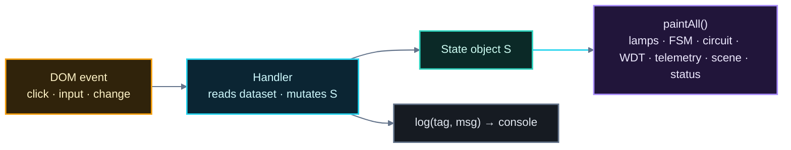
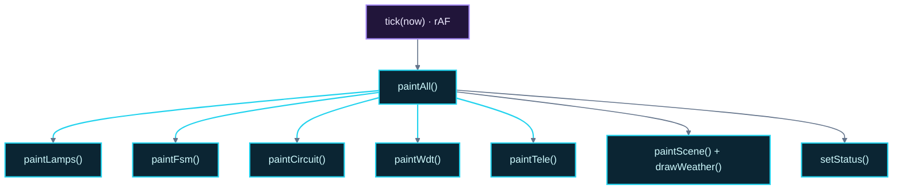
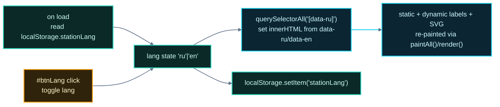

# Smart Traffic System — Utility & Programming Guide

> **Short name:** Smart Traffic System · **Subtitle:** Embedded Control & Reliability Simulation
>
> Why this project is useful (education, reliability engineering, embedded-systems
> pedagogy, UI/UX demos) and a deep, code-level walkthrough of how it is built:
> vanilla HTML/CSS/JS, the state-object pattern, canvas rendering with
> `requestAnimationFrame`, declarative SVG schematics, a self-built i18n layer,
> deterministic pseudo-noise and a stochastic analytics engine.
>
> Diagrams are styled for **dark GitHub README** rendering.

---

## Table of contents

1. [Why this project matters](#1-why-this-project-matters)
2. [Use cases](#2-use-cases)
3. [Repository layout and tech stack](#3-repository-layout-and-tech-stack)
4. [Front-end architecture](#4-front-end-architecture)
5. [The state-object pattern (heart of the app)](#5-the-state-object-pattern-heart-of-the-app)
6. [Rendering pipeline](#6-rendering-pipeline)
7. [Canvas engine (oscilloscope & weather scene)](#7-canvas-engine-oscilloscope--weather-scene)
8. [Declarative SVG schematics](#8-declarative-svg-schematics)
9. [The i18n system](#9-the-i18n-system)
10. [Simulation design](#10-simulation-design)
11. [The analytics engine](#11-the-analytics-engine)
12. [Performance and rendering notes](#12-performance-and-rendering-notes)
13. [Known limitations and caveats](#13-known-limitations-and-caveats)
14. [Extension roadmap](#14-extension-roadmap)

---

## 1. Why this project matters

This project is not a "business app". It is a **reliability-engineering artifact** that
makes a real electronic trade-off visceral and testable. Its practical value:

- **Electronics education.** Two real parts (NE555 bipolar timer vs К561ТЛ1 / 40106-class
  CMOS Schmitt trigger) are compared on supply current, output drive, switching accuracy
  and noise immunity. The numbers come straight from datasheet-grade reasoning and are
  visible *in action* (scope, watchdog, false-trigger logs), not just printed in a table.
- **Reliability / safety engineering teaching.** Watchdog timeouts, heartbeat loss,
  failover relays, MTBF, false-positive alarm rates — these are the vocabulary of
  safety-critical control (railways, CNC, medical, aerospace). Here it is all
  observable end-to-end with fault injection buttons.
- **Embedded-systems pedagogy.** PIR motion, MCP3008 ADC over SPI, DS3231 RTC over I²C,
  opto-isolated GPIO interrupts, ULN2003 lamp drivers, SPDT failover relays and a real
  Raspberry-Pi pinout map (pins 3/5/11/13/15/16/29/37) — a complete low-level I/O story.
- **Deterministic simulation craft.** Each sub-system is a clean, explicit model
  (phase timing, watchdog drain, stochastic triggers). No opaque AI/ML black boxes —
  everything is provable from the code.
- **Zero-dependency demo.** Four HTML files, offline, bilingual, no build step. Ideal for
  classrooms, exhibitions and self-study on any machine.

---

## 2. Use cases

1. **Classroom lab** on timers & reliability: run the stress test, switch chips on the
   scope, watch jitter, then discuss MTBF/energy trade-offs.
2. **Research-bench mockup** for a university final project on "smart traffic
   management" — the adaptive timing layer is a cheap, honest form of intelligence.
3. **Embedded-CS demonstration** of how a microcontroller supervises itself (watchdog)
   and degrades gracefully (backup core instead of dead intersection).
4. **Front-end teaching sample** of modern vanilla-JS techniques without frameworks:
   single-state rendering, canvas, SVG, i18n, localStorage.

---

## 3. Repository layout and tech stack

```
smart_traffic_system/
├── index.html                  # hub / navigation
├── traffic_control_station.html# interactive controller (largest page, ~836 lines)
├── analytics.html              # reliability stress-test simulation
├── oscilloscope.html           # real-time scope + eye diagram
└── docs/
    ├── INDEX.md                # documentation index (this repo's doc entry point)
    ├── SCIENCE_GUIDE.md        # scientific explanation + diagrams
    └── ENGINEERING_USAGE.md    # this file
```

**Technology stack:** vanilla HTML5, CSS3 (custom properties, grids, keyframes),
vanilla ES5-strict JavaScript. **No frameworks, no build tools, no network at runtime.**

---

## 4. Front-end architecture

All four pages follow the same architectural skeleton:

- A `<style>` block with a shared **CSS design system** in `:root` custom properties
  (dark theme: background `#0b0f14`, panels `#121922`, accent teal `#36d3b0`,
  secondary blue `#2aa0ff`, semantic lamp colors, monospace stacks).
- Semantic `<section class="card">` panels for content.
- One **IIFE** (`(function(){ "use strict"; ... })()`) wrapping all logic — no global
  pollution, no modules needed, works from `file://`.
- A **single mutable state object** `S` (or `lang` in smaller pages).
- A **render/paint pipeline** mutated by event handlers.
- An **i18n traversal** over `[data-ru]` / `[data-en]` attributes.

---

## 5. The state-object pattern (heart of the app)

The station page keeps essentially the *entire system state* in one object `S`:

```js
const S = {
  powered:false, mode:"manual", running:false, faulted:false, lang:"ru",
  selected:"K561TL1", relay:"primary", idx:0, remaining:30, wdt:30,
  speed:5, simClock:0, cycles:0, failovers:0, motionCount:0,
  falseTriggers:0, motionPending:false,
  blinkAcc:0, blinkOn:true, windNoiseAcc:0,
  foByChip:{NE555:0,K561TL1:0}, ftByChip:{NE555:0,K561TL1:0},
  env:{season:"summer", tod:"day", air:false, wind:1, precip:"none"}
};
```

Why it is good design:

- **Single source of truth.** Every button handler mutates `S`, then calls `paintAll()`,
  which re-renders lamps, FSM strip, circuit SVG, watchdog gauge, telemetry, scene and
  status pill from `S`. There is no scattered local state to disagree.
- **Deterministic.** The whole simulation is a pure function of `S` + elapsed `dt` +
  explicit randomness calls.
- **Save/restore & reset** are trivial (`btnReset` just re-inits fields, including the
  per-chip counters `foByChip`/`ftByChip`).

Flow of a typical interaction:



---

## 6. Rendering pipeline

The station page is the best example of a **layered render**:

```
paintLamps()   → lamp circles & traces lit/dim from FSM state (blink in NIGHT/AIR)
paintFsm()     → which phase chip is "current"
paintCircuit() → SVG board: power rail lit, relay arm position, IC active/dim,
                 sensor boxes highlighted
paintWdt()     → watchdog gauge width/color + KPI text
paintTele()    → all telemetry K/V values incl. per-chip counters
paintScene()   → sky gradient, sun/moon, ground, weather particles, air banner
setStatus()    → status pill (POWER OFF / AIR-RAID / FAULT / BACKUP / NIGHT / AUTO)
```

Priority logic is explicit: `AIR → FAULT → BACKUP → NIGHT → RUNNING/PAUSED` — this is
the correct precedence for a safety controller and it is reflected in `setStatus()` and
`effMode()` (`effMode()` returns `"AIR"`, `"NIGHT"`, or `"NORMAL"`, and everything else
branches on it).



---

## 7. Canvas engine (oscilloscope & weather scene)

Two jobs depend on the `<canvas>` API:

### 7.1 The oscilloscope (`oscilloscope.html`)

- **Device-pixel-ratio handling:** `setup()` multiplies the backing store by
  `devicePixelRatio` and calls `setTransform(dpr,0,0,dpr,0,0)` so the drawing is crisp
  on Retina/4K screens while CSS size stays responsive.
- **One-sample-per-pixel sweep:** the scope samples `N = width` points per lane and
  strokes the polyline, giving a smooth live waveform; the timebase window is
  `[S.t - tb, S.t]`, scrolled by the animated `S.t`.
- **Live loop:** `requestAnimationFrame(frame)` advances `S.t += dt·spd` only while
  `running`, then re-draws scope and measurements. The **eye diagram** redraws on its
  own `setInterval` (90 ms) so the jitter band visibly smears.
- **Deterministic pseudo-noise** (see §10) keeps edges wobbling but coherent.

### 7.2 The weather scene (station page)

- Pre-built particle banks per precipitation type (`buildParts()`): rain (170), snow
  (120), hail (90); each particle carries `{x, y, r, v, ph}`.
- `drawWeather()` steps particles each frame; wind force biases `x += wind·k` so strong
  wind visibly shears rain/hail and drifts snow; snow particles wiggle with `sin(ph)`.
- Canvas size is rebuilt on `resize` (and when precipitation changes).

---

## 8. Declarative SVG schematics

The station page contains two **inline SVG schematics**:

1. **Controller board** — PSU block, PIR module, primary IC (К561ТЛ1, DIP-14) and
   backup IC (NE555, DIP-8), SPDT failover relay with a movable arm line, watchdog
   block, driver block (Q1–Q3 · 220 Ω) and three lamp circles with power rails.
2. **Sensor / I/O subsystem** — five field sensors, MCP3008 ADC, opto-isolator, DS3231
   RTC, controller, output stage, linked by analog (amber), digital (blue) and bus
   (teal) paths with arrow markers.

**The trick:** circuits are not redrawn in JS. CSS classes (`lamp.on`, `trace.live`,
`chip-body.active/dim`, `.hl` highlight) are toggled by `paintCircuit()`, and the relay
arm is just an SVG `<line>` whose `x2/y2` attributes move between the two contacts.
Stock metadata (`data-*` for i18n labels) is stored directly in the SVG, so language
switching also re-labels diagrams. Declarative + class-driven = cheap, readable "live"
schematics.

---

## 9. The i18n system

A minimal but effective bilingual layer, identical across pages:

- Every translatable element carries `data-ru` and `data-en` attributes (including
  nested SVG text and dynamic button labels).
- `applyLang()` walks `querySelectorAll("[data-ru]")` and assigns the chosen
  language's string via `innerHTML`.
- The current language is stored in `localStorage` under `stationLang` and read on load.
- Dynamic strings go through `tr(ru, en)` (or `L(map, key)` with `[ru,en]` pairs).



Shared language means flipping it on any page immediately propagates to the others.

---

## 10. Simulation design

### 10.1 Real-time heart

Every page runs a `requestAnimationFrame` loop with dt computed from
`performance.now()` deltas (`real = (now - last)/1000`), so animation speed matches real
time. The station then scales time by the speed control in auto mode (`dt·speed`) and
shrinks it in manual mode — a clean "time dilation" of the simulation.

### 10.2 Module timers

- `blinkAcc` accumulates real seconds; at 0.5 s it toggles `blinkOn` and re-paints lamps
  only when in NIGHT/AIR mode.
- `windNoiseAcc` accumulates exposure time; at 3 s (poor) / 8 s (good) it rolls a dice
  to emit false-trigger events with probability `(wind-2)·0.12·(poor?2:0.5)`.

### 10.3 Deterministic noise for the clock

The oscilloscope clock jitter uses `noise(τ) = sin(τ·37.1)+sin(τ·71.7)+sin(τ·113.3)` —
incommensurate frequencies sum into a pseudo-random-looking but **fully deterministic**
function of time (no state, no `Math.random`, stable edges that still look "live").

### 10.4 Event probability model

| Event | Probability / rate | Chip dependence |
|---|---|---|
| Motion button → true green request | 1 − prob(false) | `prob = (poor?0.25:0.05) + wind·0.04` |
| Motion button → false trigger | `prob` above | poor chip far more likely |
| Ambient noise false trigger (wind ≥ 3) | `(wind-2)·0.12·(poor?2:0.5)` per expiry | poor chip 2× |
| Watchdog failover | drain `WDT` to 0 | only after fault injection |

These numbers are deliberately *plausible*, not measured — the pages say so.

---

## 11. The analytics engine

`analytics.html` is a self-contained **stochastic simulator**. Core design:

- `simulate(hours, cond)` slices the horizon into an ensemble of `steps`
  (24–120, denser for short runs) and walks each chip independently.
- It consumes the `CHIP` parameter table (current, accuracy, false-trigger rate,
  WDT false-positive fraction) and `COND` table (stress multiplier `m`, daily events).
- Every slice draws randomness (`0.7 + 0.6·rand()`) around the expectation, so re-runs
  vary slightly but preserve the *ordering* of the two chips.
- Outputs feed KPI cards, canvas bar/line charts (log scale for current, to fit
  10 000 µA vs 0.4 µA on one chart) and a 7-metric summary table with a winner column.

---

## 12. Performance and rendering notes

- No libraries, no network, no layout thrash: the only continuous work is rAF drawing +
  a 90 ms eye-diagram interval on the scope page.
- Canvas drawing is DPR-aware and clipped to its own cleared region each frame.
- The station console caps at 140 lines (`while (term.children.length>140) removeChild`)
  to avoid unbounded DOM growth over a long session.
- Resize handling rebuilds canvas size and (on the station) the weather particle bank.
- The scope samples once per pixel per lane — 4 lanes × width ≤ ~4 000 points/frame,
  trivially fast for a 60 Hz loop.

---

## 13. Known limitations and caveats

1. **Not measurement — model.** All jitter/wearout numbers are datasheet-scale or made
   plausible; the analytics footer states this explicitly.
2. **`innerHTML` in `log()` and `applyLang()`** — the log builds strings with
   `innerHTML`. Safe offline, but echoing untrusted input here would be an XSS vector;
   `textContent` is used for telemetry to mitigate most paths.
3. **Stochastic runs differ.** `Math.random()` is unseeded — re-running the stress test
   yields slightly different numbers (statistically stable ordering).
4. **No automated tests.** The codebase is a demo; adding unit tests for `durFor`,
   `phaseAt`, `simulate` and the i18n walk would harden it.
5. **ES5-era style** (var, function expressions) — chosen for maximum `file://`
   compatibility (e.g., old browsers/hardware) at the cost of some modern ergonomics.
6. **`effMode()` precedence** is baked into branch order — a new mode (e.g.,
   "EVENT_PREEMPTION") must be inserted deliberately at the right priority.

---

## 14. Extension roadmap

| Idea | Difficulty | Where |
|---|---|---|
| Seedable RNG for reproducible analytics | low | analytics.html |
| Live phase-blueprint / timing editor | medium | station |
| Solar/battery power budget view | medium | analytics |
| Real MIDI/WebAudio sonification of alarms | low | station, oscilloscope |
| Snapshot/export of a session's telemetry CSV | low | station |
| Unit tests (Vitest-free, tiny runner) | low | all pages |
| Second intersection / four-way coordination | high | station (multi-FSM) |
| Port the controller logic to actual Raspberry Pi GPIO (RPi.GPIO) | medium | station model already documents pins |

---

## Appendix A — file & function map

| Function (page) | Purpose |
|---|---|
| `durFor(idx)` (station) | environment-modulated phase duration |
| `enter` / `advance` (station) | FSM transitions + watchdog pet on enter |
| `petWatchdog` / `doFailover` (station) | heartbeat re-arm & backup hand-off |
| `triggerFalse(k)` (station) | per-chip false-trigger accounting |
| `tick(now)` (station) | rAF master: blink, weather, FSM, WDT, telemetry |
| `paintAll()` (station) | full re-render aggregate |
| `simulate(hours, cond)` (analytics) | stochastic reliability model |
| `render()` (analytics) | charts + KPI + summary table |
| `phaseAt(tau)` / `clkAt(tau)` (oscilloscope) | FSM lane & jittery clock generation |
| `noise(τ)` (oscilloscope) | deterministic pseudo-noise |
| `drawScope` / `drawEye` (oscilloscope) | live scope + eye diagram |

## Appendix B — default metrics snapshot

| Metric | NE555 | К561ТЛ1 |
|---|---|---|
| Supply current | 10 000 µA | 0.4 µA |
| Switching accuracy | 50 µs | 5 µs |
| False-trigger rate | 0.02 | 0 |
| WDT false-positive rate | 0.05 % | 0 |
| Output drive | 200 mA | 3.4 mA |