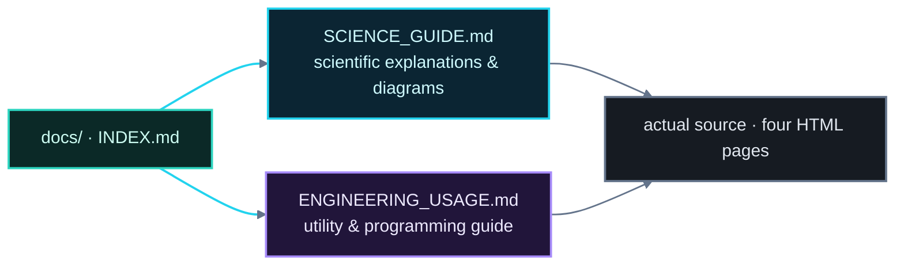

# Smart Traffic System — Documentation Index

> **Short name:** Smart Traffic System · **Subtitle:** Embedded Control & Reliability Simulation
>
> Entry point for the project documentation.

---

## Project at a glance

**Smart Traffic System** — *Embedded Control & Reliability Simulation* — is an offline,
bilingual (RU/EN) research & teaching bench that
compares two timer technologies — the **NE555** (bipolar) and the **К561ТЛ1** (CMOS
Schmitt-trigger) — as the timing core of a safety-redundant traffic-light controller:
FSM phase sequencing, watchdog + failover relay, environment-adaptive timing, a
stochastic reliability model and a live oscilloscope with jitter analysis. All in
four standalone HTML files with zero dependencies and no server.

---

## Documentation files

| File | Purpose | Read it to learn |
|---|---|---|
| [`SCIENCE_GUIDE.md`](./SCIENCE_GUIDE.md) | Scientific deep-dive with diagrams | What the system models, the electronics of both chips, the FSM, watchdog/failover, sensing subsystem, reliability math, jitter & eye diagrams, glossary, full parameter appendix |
| [`ENGINEERING_USAGE.md`](./ENGINEERING_USAGE.md) | Utility & programming deep-dive | Why the project is useful (education / safety / embedded), the code architecture, state-object pattern, canvas engine, SVG schematics, i18n, simulation design, analytics engine, limitations and extension roadmap |

---

## How to read this documentation

1. **Start with the science guide** for full understanding of *what* the system is and
   *why* it behaves as it does — every phase, timer, sensor and formula is explained and
   diagrammed. Its [Appendix: parameter reference](./SCIENCE_GUIDE.md#12-appendix-parameter-reference)
   is the single source of key numbers.
2. **Then read the engineering & usage guide** for *how* it is implemented and *how to
   use / extend* it — code architecture, rendering, i18n, analytics engine, limitations.
3. **Open the app itself**: `index.html` → `traffic_control_station.html` (power on,
   switch chips, inject faults, try air-raid/night) → `analytics.html` (run a stress
   test) → `oscilloscope.html` (flip chips and watch jitter).

---

## Page ↔ documentation map

| Page | Science guide section | Engineering guide section |
|---|---|---|
| `index.html` | [§4 System architecture](./SCIENCE_GUIDE.md#4-system-architecture) | [§3 Layout & stack](./ENGINEERING_USAGE.md#3-repository-layout-and-tech-stack) |
| `traffic_control_station.html` | [§5 FSM](./SCIENCE_GUIDE.md#5-the-traffic-light-finite-state-machine), [§6 Sensing](./SCIENCE_GUIDE.md#6-environment-sensing-subsystem), [§7 Watchdog](./SCIENCE_GUIDE.md#7-fault-tolerance-watchdog-and-redundancy) | [§5 State object](./ENGINEERING_USAGE.md#5-the-state-object-pattern-heart-of-the-app), [§6 Rendering](./ENGINEERING_USAGE.md#6-rendering-pipeline), [§7–10 Canvas/SVG/i18n/sim](./ENGINEERING_USAGE.md#7-canvas-engine-oscilloscope--weather-scene) |
| `analytics.html` | [§8 Reliability model](./SCIENCE_GUIDE.md#8-the-stochastic-reliability-model) | [§11 Analytics engine](./ENGINEERING_USAGE.md#11-the-analytics-engine) |
| `oscilloscope.html` | [§9 Signal integrity](./SCIENCE_GUIDE.md#9-signal-integrity-clock-phases-and-jitter) | [§7 Canvas engine](./ENGINEERING_USAGE.md#7-canvas-engine-oscilloscope--weather-scene), [§10 Simulation](./ENGINEERING_USAGE.md#10-simulation-design) |

---

## Quick facts

- **Nominal traffic cycle:** 60 s — RED 30 s → R+Y 2 s → GREEN 25 s → YELLOW 3 s.
- **Watchdog:** 30 s; drains on fault; at 0 → failover to NE555 backup.
- **Chip gap:** current 10 000 µA vs 0.4 µA (~25 000×), accuracy 50 µs vs 5 µs, noise
  immunity poor vs excellent.
- **Clock:** 2 Hz, 0.5 s period; jitter ±50 µs (NE555) vs ±5 µs (К561ТЛ1).

> All diagrams in these docs use one semantic dark-theme color system (cyan = core
> architecture, violet = models/intelligence, teal = persistence, amber = external,
> rose = error paths, slate = infra) designed for a black GitHub README.