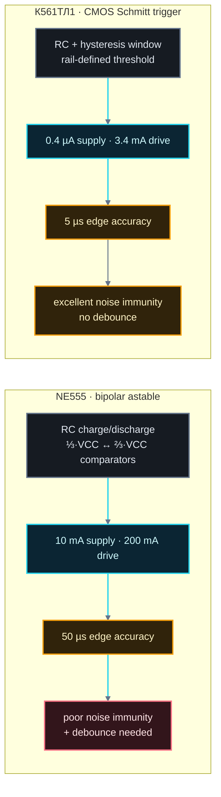
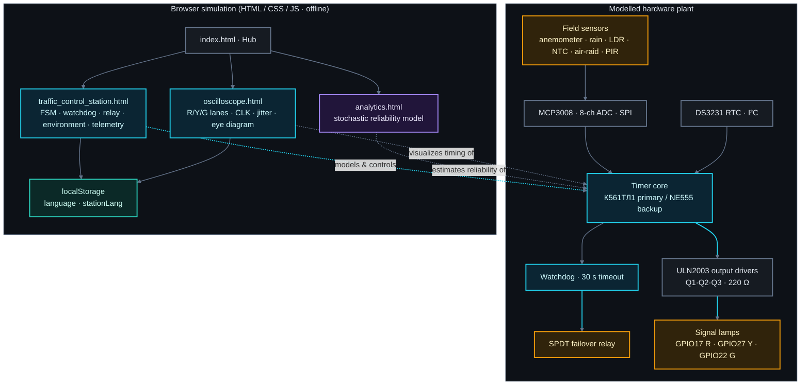
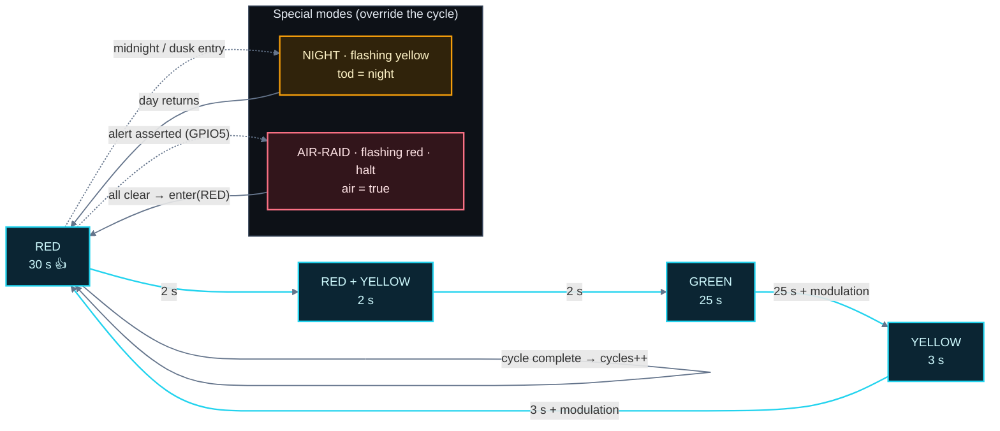
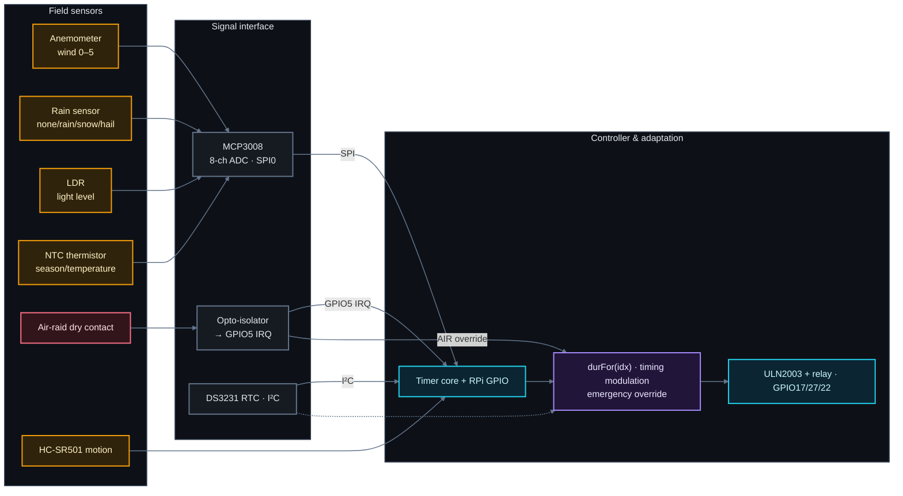
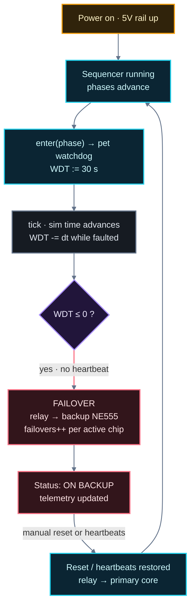
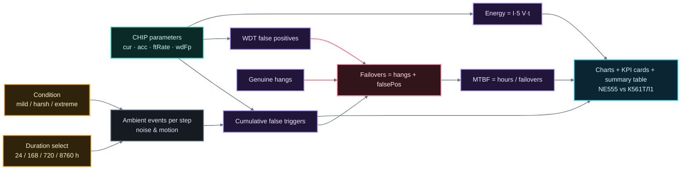
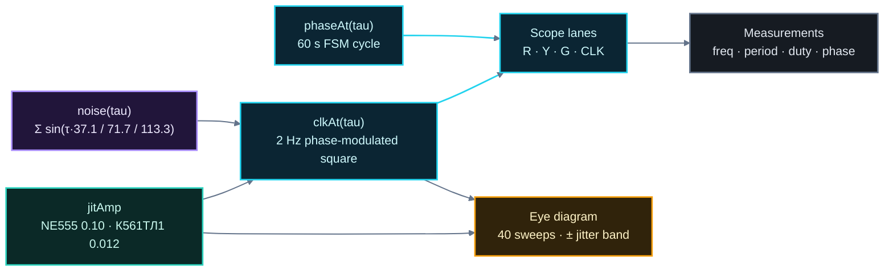

# Smart Traffic System — Scientific Deep-Dive

> **Short name:** Smart Traffic System · **Subtitle:** Embedded Control & Reliability Simulation
>
> **A browser-based research and teaching bench** that simulates a traffic-light controller
> built around two competing timer technologies — the **NE555** (bipolar) and the
> **К561ТЛ1** (CMOS Schmitt-trigger) — and quantifies their reliability, accuracy and
> noise immunity inside a full, interactive embedded-controller model.
>
> All diagrams in this document are designed for a **dark / near-black GitHub README**
> background (consistent semantic color system).

---

## Table of contents

1. [What this project is](#1-what-this-project-is)
2. [Engineering context and problem statement](#2-engineering-context-and-problem-statement)
3. [The two timer technologies](#3-the-two-timer-technologies)
4. [System architecture](#4-system-architecture)
5. [The traffic-light finite-state machine](#5-the-traffic-light-finite-state-machine)
6. [Environment sensing subsystem](#6-environment-sensing-subsystem)
7. [Fault tolerance: watchdog and redundancy](#7-fault-tolerance-watchdog-and-redundancy)
8. [The stochastic reliability model](#8-the-stochastic-reliability-model)
9. [Signal integrity: clock, phases and jitter](#9-signal-integrity-clock-phases-and-jitter)
10. [Conclusions](#10-conclusions)
11. [Glossary](#11-glossary)
12. [Appendix: parameter reference](#12-appendix-parameter-reference)

---

## 1. What this project is

A self-contained, **server-free** web application consisting of four HTML pages
(`index.html`, `traffic_control_station.html`, `analytics.html`, `oscilloscope.html`).
Each page is a standalone simulation written in vanilla HTML/CSS/JS and runs entirely
offline in a browser. The application is bilingual (Russian / English) with persistence
across pages via `localStorage`.

| Page | Role |
|---|---|
| `index.html` | Hub / navigation page describing the bench |
| `traffic_control_station.html` | Interactive embedded controller: signal-phases, watchdog, failover, environment |
| `analytics.html` | Reliability stress-test simulation (MTBF, false triggers, energy, accuracy) |
| `oscilloscope.html` | Real-time signal scope: R/Y/G lanes + timer clock, edge-jitter and eye diagram |

The physical system being modelled is a realistic **street traffic controller**:

- a microcontroller (Raspberry Pi GPIO) drives a traffic light through output drivers;
- the **phase timing source** ("timer core") is either the К561ТЛ1 or the NE555;
- a **watchdog** supervises the primary core and, on heartbeat loss, switches a
  failover relay to the backup core;
- a **field-sensor subsystem** (anemometer, rain sensor, light sensor, temperature
  thermistor, air-raid contact, RTC) adapts phase timing to weather, time of day and
  emergency conditions;
- a **PIR motion sensor** can extend the green phase.

### 1.1 Simulation abstraction scope

> **Important:** This project is an **abstract system-level simulation**, not an
> electronic circuit simulator.

The simulation models the **behavior, states, timing, control logic, signals, failures,
and interactions of a smart traffic-control system at the system level**. It does **not**
simulate the physical electrical behavior of individual electronic components or
reproduce the internal operation of real electronic circuits.

Therefore:

- Do **not** interpret the project as a SPICE-like circuit simulation.
- Do **not** assume that individual transistors, capacitors, resistors, CMOS gates,
  Schmitt triggers, timers, relays, or other components are electrically simulated at
  their physical level.
- Physical/electronic concepts such as **voltage, current, resistance, RC time
  constants, noise, hysteresis, NE555, CMOS logic, watchdog circuits, and relays** are
  used as **conceptual or behavioral abstractions** that explain how a corresponding
  real-world system could operate.
- The program represents their **observable/system-level effects**, such as timing,
  state transitions, signal generation, fault detection, debouncing behavior, failover,
  and mode switching, rather than calculating their complete electrical physics.
- The JavaScript implementation should therefore be interpreted as a **software
  representation of the behavior of a hypothetical electronic control system**, not as
  a direct digital reconstruction of its physical circuitry.

#### Two distinct levels of interpretation

The documentation clearly distinguishes between:

**1. Physical / Electronic System** — a hypothetical real-world traffic controller
composed of sensors, timers, logic circuits, relays, power supplies, signal lamps,
watchdog mechanisms, and other electronic components.

**2. Abstract Software Simulation** — a browser-based model that represents the
important **functional behavior** of that system using software states, timers,
variables, events, signal abstractions, finite-state-machine logic, failure scenarios,
and analytical measurements.

The relationship can therefore be expressed as:

**Real Physical System → Functional Abstraction → Software Simulation**

The software does not reproduce the complete physical system. Instead, it reproduces the
**system-level behavior that is relevant to understanding, testing, teaching, and
analyzing the control architecture**.

#### Documentation rule for this guide

Whenever an electronic component or physical mechanism is discussed, the guide
explicitly distinguishes:

- **what happens physically in a real electronic implementation**, and
- **how that behavior is abstracted and represented inside the software simulation**.

The browser simulation does not physically calculate phenomena that it only represents
conceptually. The primary focus remains on:

**system behavior → control logic → state transitions → timing → signals → fault
handling → failover → monitoring → analytics.**

---

## 2. Engineering context and problem statement

A traffic-light controller is a **safety-relevant real-time system**:

- it must produce a guaranteed, unambiguous lamp sequence (never "red + green");
- it must remain correct under power, temperature, vibration and electromagnetic noise;
- a failing timing core must not lead to a dangerous intersection state — hence
  redundancy and watchdog supervision.

The bench frames a classic trade-off between two timer technologies:

1. **NE555 (bipolar 555)** — the ubiquitous analog timer: high output drive, but
   comparatively poor supply-noise immunity, an edge accuracy of ~50 µs, ~10 mA idle
   current, and it typically needs input debounce.
2. **К561ТЛ1 (CMOS Schmitt-trigger, ~40106-class)** — four Schmitt-trigger inverter
   gates on one DIP-14 chip: micro-amp power draw (0.4 µA), ~5 µs edge accuracy,
   intrinsic noise immunity thanks to built-in hysteresis, no debounce required; it
   only loses on raw output current (3.4 mA vs 200 mA).

The engineering question simulated everywhere in this project is: **which core is the
more reliable, precise and noise-immune choice for a traffic controller, and under what
conditions does the backup architecture keep the intersection safe?**

---

## 3. The two timer technologies

### 3.1 NE555 — bipolar timer (astable mode)

The classic 555 in astable mode oscillates by charging/discharging an external RC
network between the two comparator thresholds (⅓·V<sub>CC</sub> and ⅔·V<sub>CC</sub>).
Its timing precision is limited by:

- comparator input offsets and hysteresis;
- dependence of thresholds on supply voltage and temperature;
- bipolar transistor leakage and switching-timing asymmetries.

Consequences used by the simulator: **poor noise immunity**, **50 µs switching
accuracy**, **10 mA supply current**, debounce required, **200 mA drive** output.

### 3.2 К561ТЛ1 — CMOS Schmitt-trigger

A CMOS Schmitt-trigger inverter oscillates by feeding its own output back through an RC
network; the switching threshold is a **well-defined fraction of the rail** and the
internal **hysteresis window** makes transitions immune to slow or noisy inputs. CMOS
logic draws current only during transitions → **0.4 µA quiescent**. Hysteresis
eliminates the need for external debounce and yields **~5 µs** stable edges.

### 3.3 Head-to-head metrics (as modelled)

| Parameter | NE555 (bipolar) | К561ТЛ1 (CMOS) | Winner |
|---|---|---|---|
| Supply current | 10 mA (10 000 µA) | 0.4 µA | К561ТЛ1 (~25 000× less) |
| Output current | 200 mA | 3.4 mA | NE555 |
| Switching accuracy | 50 µs | 5 µs | К561ТЛ1 (10× tighter) |
| Noise immunity | poor | excellent | К561ТЛ1 |
| Debounce | needed | not needed | К561ТЛ1 |
| False-trigger rate (model) | 0.02 / event | 0.0 | К561ТЛ1 |
| WDT false-positive rate (model) | 0.05 % | 0.0 | К561ТЛ1 |

### 3.4 Technology diagram



---

## 4. System architecture

The high level shows the **modelled hardware plant** on the left (what the sim
represents: sensors, ADC, RTC, timer cores, watchdog, relay, drivers, lamps) and the
**browser simulation layer** on the right (the four HTML pages). The hardware is never
real — it is a faithful *model* that each page visualizes from a different angle.



---

## 5. The traffic-light finite-state machine

### 5.1 Base sequence and timings

The controller implements the canonical four-state cycle (60 s nominal, configurable
5×–20× sim-speed):

| State | Key | Red | Yellow | Green | Base duration |
|---|---|---|---|---|---|
| 1 | RED | ● | | | 30 s |
| 2 | RED_YELLOW | ● | ● | | 2 s |
| 3 | GREEN | | | ● | 25 s |
| 4 | YELLOW | | ● | | 3 s |

Invariant property: **the lamp vector never contains Red+Green simultaneously** — the
only pair allowed is the safety intermediate Red+Yellow.

### 5.2 State diagram



### 5.3 Environment modulation of phase duration

The runtime function `durFor(idx)` adjusts the base duration from the environment state:

| Condition | Phase | Delta |
|---|---|---|
| Rush hour (morning or evening) | GREEN | +10 s |
| Rain | GREEN | +5 s |
| Snow | GREEN | +8 s |
| Snow | YELLOW | +2 s |
| Snow | RED_YELLOW | +1 s |
| Hail | YELLOW | +2 s |
| Winter season | YELLOW | +1 s |
| Winter season | RED_YELLOW | +1 s |
| Pending PIR motion event | GREEN | +5…15 s (5 + rand·10) |

This makes the controller *environment-adaptive*: it gives congested, rainy or icy
traffic more green time and extends warning phases where stopping distances grow.

### 5.4 Motion (PIR)

- A **true motion event** sets `motionPending = true`; the next time GREEN is entered,
  the phase is extended by `5 + rand(0..10)` seconds, and the flag clears.
- A **false trigger** (noise/wind) increments the chip-specific `falseTriggers`
  counter instead (see Sections 6 and 8).

### 5.5 Emergency modes

- **NIGHT** (`tod === "night"`): flashing yellow, 0.5 s blink period — reduced demand
  signalling for late-night traffic.
- **AIR-RAID** (`air === true`): flashing red, movement halted; the on-scene banner
  pulses and the status pill becomes an animated alert. Clearing the alert returns the
  controller to state 0 (RED).

---

## 6. Environment sensing subsystem

The station page documents an I/O sheet (items **2.1–2.5**) mapping physical field
sensors onto the controller bus:

| Signal | Sensor | Interface | Raspberry Pi mapping |
|---|---|---|---|
| Wind | Anemometer | analog → MCP3008 CH0 | SPI0 (pins 19/21/23/24) |
| Precipitation | Rain sensor | analog → MCP3008 CH1 | SPI0 |
| Light / time of day | LDR photoresistor | analog → MCP3008 CH2 | SPI0 |
| Season / temperature | NTC thermistor | analog → MCP3008 CH3 | SPI0 |
| Time & date | DS3231 RTC | I²C | SDA1/SCL1 (pins 3/5) |
| Air-raid | dry contact → opto-isolator | discrete input + IRQ | GPIO5 (pin 29) |
| Motion | HC-SR501 (BISS0001) | discrete input + IRQ | GPIO23 (pin 16) |
| Lamp outputs | LED + ULN2003 Q1–Q3 | GPIO out | GPIO17/27/22 (pins 11/13/15) |
| Core redundancy | SPDT relay coil + watchdog | coil drive | GPIO26 (pin 37) |

### Subsystem diagram



Analogue signals are digitized over SPI; time comes from the RTC; the air-raid line is
an opto-isolated level-triggered interrupt. The controller folds all of this into phase
timings and emergency modes — the *adaptive intelligence* of the system.

---

## 7. Fault tolerance: watchdog and redundancy

The controller treats the timing core as a **fail-prone unit**: an injected "core hang"
(fault button) simulates a wedge, after which the heartbeat disappears. The watchdog
drains from 30 s to 0 and, at 0, **auto-switches the SPDT relay to the backup NE555**
and continues the cycle.

In **manual mode** the operator must press "♥ Pet watchdog" to re-arm the timer before
it empties. In **auto mode** the sequencer pets the watchdog on every phase entry.



Design rationale: a watchdog + passive-standby pair is the minimal, deterministic way
to keep a safety controller alive — the backup needs no continuous supervision because
the primary's own heartbeat failure is what engages it. The bench lets the operator
*observe* this exact scenario and watch telemetry react (faulted state, drain, failover,
chip counters).

---

## 8. The stochastic reliability model

`analytics.html` runs a Monte-Carlo-style simulation over a configurable horizon
(24 h, 168 h, 720 h, 8760 h) and over three conditions (mild / harsh / extreme). It
produces both chips' MTBF, false triggers, watchdog false positives, failovers, energy,
and accuracy — from the chip parameters in the internal `CHIP` model
("from config.yaml" per the page footnote).

### 8.1 Input parameters

```
CHIP.NE555   { cur_uA: 10000, acc_us: 50, ftRate: 0.02, wdFp: 0.05 }   /* amber */
CHIP.K561TL1 { cur_uA: 0.4,   acc_us: 5,  ftRate: 0.0,  wdFp: 0.0 }    /* teal  */

COND.mild    { m: 0.5,  events: 24  }   /* events per day, stress multiplier m   */
COND.harsh   { m: 1.0,  events: 60  }
COND.extreme { m: 2.2,  events: 120 }
```

The horizon is sampled into `steps` steps (adaptive between 24 and 120).

### 8.2 Model formulas (as implemented)

```
events    = (cond.events / 24) · stepDuration                     # ambient noise/motion events
ftHere    = events · ftRate · cond.m · (0.7 + 0.6 · rand())      # false triggers for this slice
ftCum    += ftHere                                               # cumulative false triggers

checks    = stepDuration · 3600 / 0.5                            # watchdog checks every 0.5 s
fp        = checks · (wdFp / 100) · cond.m · 0.02                # WDT false-positive probability
falsePos += round(fp) if rand() < fp

hangs     = max(0, round(hours/2000 + rand()·1.5))               # genuine core hangs
failures  = hangs
failovers = hangs + falsePos                                     # failover needs a trigger event

mtbf      = failovers > 0 ? hours / failovers : hours            # h
energyWh  = cur_uA · 1e-6 · 5.0 · hours                          # I(A) · V(5 V) · t(h)
```

Interpretation notes:

- **False triggers** scale with the event rate and the condition stress `m`, and are
  amplified by the poor-immunity chip's `ftRate` (0.02 vs 0.0) — NE555 accumulates.
- **WDT false positives** (spurious failovers caused by noise upsetting the watchdog)
  are non-zero only for the bipolar chip.
- **Genuine hangs** are equal for both chips (the failure rate of the controller
  hardware, not the cell); this isolates the chip-specific contribution.
- **MTBF** is horizon ÷ failover count → a dominant reliability KPI.
- **Energy** is drawn from quiescent current at a 5 V rail → the CMOS advantage
  (~25 000× less) becomes a decisive long-run power figure for battery/solar nodes.

### 8.3 Model pipeline



### 8.4 Decision support

The rendered summary counts how many of the seven metrics each chip wins and outputs a
recommendation: **К561ТЛ1 is recommended as primary core** (wins current, accuracy,
false triggers, WDT false positives, MTBF, energy), while **NE555 remains the backup**
because of its high output drive.

> Disclaimer baked into the page: it is "a simulation, not real-hardware measurements".

---

## 9. Signal integrity: clock, phases and jitter

`oscilloscope.html` renders four live lanes — **R**, **Y**, **G** and the timer **CLK**
(2 Hz clock, 0.5 s period) — plus a zoomed **eye diagram** of the clock edge. Its whole
educational point is to make the 10× jitter difference (50 µs vs 5 µs) **visible**.

### 9.1 Signal generation model

- The **phase process** `phaseAt(tau)` maps simulation time onto the 60 s cycle and
  returns the active state, driving the R/Y/G digital lanes.
- The **clock process** `clkAt(tau)` is a phase-modulated square wave:

```
phase   = tau / T_period + amp · noise(tau)     # T_period = 0.5 s
noise   = sin(τ·37.1) + sin(τ·71.7) + sin(τ·113.3)   # deterministic pseudo-noise
signal  = 1 if sin(phase·2π) ≥ 0 else 0
amp     = jitAmp: NE555 0.10  |  К561ТЛ1 0.012        # normalized-for-visibility
```

The three-sine pseudo-noise is **deterministic in τ** (no hidden state), which keeps
the waveform stable while still looking like real edge wander. The measured label shows
the true spec `±50 µs` / `±5 µs`.

### 9.2 Jitter and the eye diagram

Jitter is the statistical dispersion of a signal edge around its ideal position. The
**eye diagram** overlays 40 rising edges, each offset randomly within the jitter band;
the width of the blurred "eye corner" is the peak-to-peak jitter. A wide-open eye
margin is the classic sign of a reliable trasceiver/timer; NE555 visibly smears the
edge versus the tight К561ТЛ1 eye.



### 9.3 What the student should observe

1. Flicking the chip selector changes only the **CLK lane** and the **eye band** width —
   phase timing is identical.
2. NE555's edges "wobble" noticeably; К561ТЛ1's look clean.
3. The measurements panel quantifies it: `±50 µs (high)` vs `±5 µs (excellent)`.

---

## 10. Conclusions

1. **Technology trade-off** — a safety-relay traffic controller needs a timing core
   that is *precise, stable under noise, and power-cheap*; on all three axes the CMOS
   Schmitt-trigger К561ТЛ1 dominates the bipolar NE555 (only output drive favors 555).
2. **Redundancy works** — watchdog + failover relay keeps the intersection cycling when
   the primary wedges; the bench's fault-injection workflow demonstrates detection,
   drain, hand-off and status reporting end-to-end.
3. **Environment adaptivity** — mapping weather/time onto phase timing is a realistic,
   low-cost "intelligence" layer (no ML required) and a nice demonstration of
   deterministic adaptation.
4. **The models are transparent** — every number on the analytics page follows an
   explicit stochastic formula, making the simulation debuggable, reproducible in
   spirit, and a clean teaching artifact for probability/reliability engineering.

---

## 11. Glossary

| Term | Meaning |
|---|---|
| Astable | Free-running oscillator; no stable resting state |
| Bipolar | Transistor-based logic/timer family (here: classic 555) |
| CMOS | Complementary metal–oxide–semiconductor logic family |
| Schmitt trigger | Comparator with two thresholds (hysteresis), immune to slow/noisy edges |
| Jitter | Random temporal deviation of a signal edge from its ideal position |
| Eye diagram | Overlaid signal edges used to judge timing/noise margin |
| FSM | Finite-state machine — here the traffic-light phase sequencer |
| Watchdog (WDT) | Hardware/software timer that must be periodically reset ("petted") |
| Failover | Automatic switch to a standby unit after a fault |
| MTBF | Mean time between failures |
| ULN2003 | Darlington-array driver for relay/lamp loads |
| MCP3008 | 8-channel 10-bit ADC over SPI |
| DS3231 | RTC with I²C interface and temperature-compensated oscillator |
| HC-SR501 / BISS0001 | PIR motion detector module |
| LDR / NTC | Light-dependent resistor / negative-temperature-coefficient thermistor |
| Opto-isolator | Electrically isolating digital input stage |

---

## 12. Appendix: parameter reference

### FSM base cycle (nominal, no modulation)

```
RED  30 s → RED_YELLOW 2 s → GREEN 25 s → YELLOW 3 s → (cycle = 60 s)
```

### Watchdog constants

```
WDT_TIMEOUT = 30 s        # arm time after every pet
remaining   = durFor(idx) # per-phase countdown (advance when ≤ 0)
```

### Chip specification table (source of all derived numbers)

| Chip | cur | acc | noise | debounce | ftRate | wdFp | pkg |
|---|---|---|---|---|---|---|---|
| NE555 | 10 000 µA | 50 µs | poor | needed | 0.02 | 0.05 % | DIP-8 |
| К561ТЛ1 | 0.4 µA | 5 µs | excellent | not needed | 0.0 | 0.0 % | DIP-14 |

### Oscilloscope timing

```
clkPeriod = 0.5 s  →  f = 2 Hz, duty 50 %
time bases:  2 s / 4 s / 8 s
phase speeds: 1× / 3× / 6×
eye sweeps:  40
```