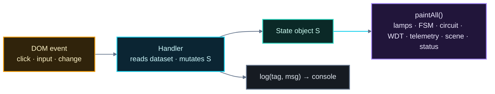
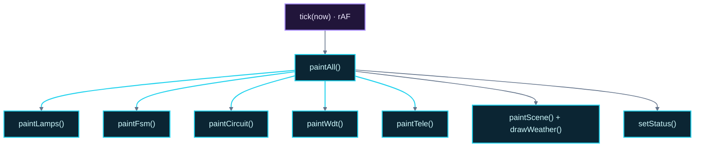
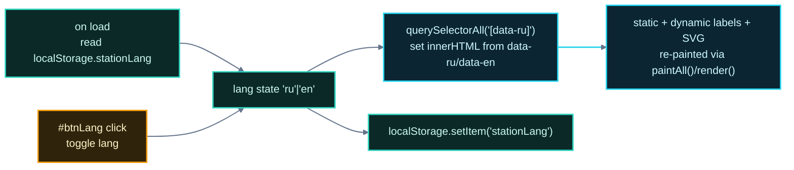
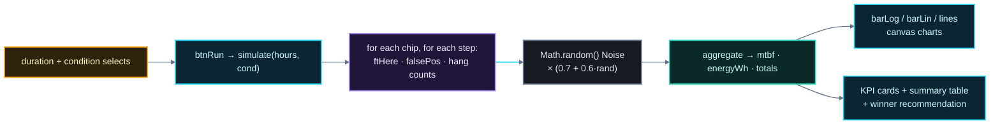

# نظام حركة المرور الذكي — دليل الفائدة والبرمجة

> لماذا هذا المشروع مفيد (التعليم، هندسة الموثوقية، طرق تدريس الأنظمة المدمجة،
> عروض "UI/UX")، وجولة عميقة على مستوى الكود في كيفية بنائه: "HTML/CSS/JS" خام،
> نمط "كائن الحالة" ("state object")، الرسم عبر "canvas" مع "requestAnimationFrame"،
> مخططات "SVG" تعريفية، طبقة "i18n" ذاتية البناء، ضوضاء زائفة حتمية، ومحرك تحليلات
> عشوائي.
>
> الرسوم البيانية مصممة لعرض "dark GitHub README".

---

## الفهرس

1. [لماذا يهم هذا المشروع](#١-لماذا-يهم-هذا-المشروع)
2. [حالات الاستخدام](#٢-حالات-الاستخدام)
3. [تخطيط المستودع ومكدس التقنيات](#٣-تخطيط-المستودع-ومكدس-التقنيات)
4. [بنية الواجهة الأمامية](#٤-بنية-الواجهة-الأمامية)
5. [نمط كائن الحالة (قلب التطبيق)](#٥-نمط-كائن-الحالة-قلب-التطبيق)
6. [خط أنابيب العرض ("rendering")](#٦-خط-أنابيب-العرض-rendering)
7. [محرك "canvas" (الراسم الذبذبي ومشهد الطقس)](#٧-محرك-canvas-الراسم-الذبذبي-ومشهد-الطقس)
8. [مخططات "SVG" التعريفية](#٨-مخططات-svg-التعريفية)
9. [نظام "i18n"](#٩-نظام-i18n)
10. [تصميم المحاكاة](#١٠-تصميم-المحاكاة)
11. [محرك التحليلات](#١١-محرك-التحليلات)
12. [ملاحظات الأداء والعرض](#١٢-ملاحظات-الأداء-والعرض)
13. [القيود والتحفظات المعروفة](#١٣-القيود-والتحفظات-المعروفة)
14. [خارطة طريق التوسيع](#١٤-خارطة-طريق-التوسيع)

---

## ١. لماذا يهم هذا المشروع

هذا المشروع ليس "تطبيق أعمال". إنه **أثر هندسة موثوقية** يجعل مقايضة إلكترونية حقيقية
ملموسة وقابلة للاختبار. قيمته العملية:

- **التعليم الإلكتروني.** مقارنة قطعتين حقيقيتين ("NE555" من نوع "bipolar" مع "К561ТЛ1"
  / فئة "40106" من نوع "CMOS Schmitt trigger") من حيث تيار التغذية وقدرة الإخراج ودقة
  التبديل وتحمّل الضوضاء. الأرقام تأتي مباشرة من استدلال بمستوى "datasheet" وهي ظاهرة
  *في العمل* (الراسم الذبذبي، "watchdog"، سجلات الإطلاق الخاطئ) وليست مجرد جدول مطبوع.
- **تدريس هندسة الموثوقية / السلامة.** زمن انتهاء "watchdog"، فقدان "heartbeat"،
  التبديل الاحتياطي ("failover")، "MTBF"، معدلات الإنذار الخاطئة — هذه مفردات
  الأنظمة الحساسة للسلامة (السكك الحديدية، "CNC"، الطب، الطيران). هنا كل ذلك قابل
  للملاحظة من البداية إلى النهاية بأزرار حقن أعطال.
- **طرق تدريس الأنظمة المدمجة.** حركة "PIR"، "MCP3008 ADC" عبر "SPI"، "DS3231 RTC"
  عبر "I²C"، مقاطعات "GPIO" منزوعة العزل بصرياً، مشغّلات أضواء "ULN2003"، ومضاعفات
  "SPDT" احتياطية وخريطة "pinout" حقيقية لـ"Raspberry Pi" (الأرجل 3/5/11/13/15/16/29/37)
  — قصة إدخال/إخراج كاملة منخفضة المستوى.
- **صنعة محاكاة حتمية.** كل نظام فرعي هو نموذج نظيف صريح (توقيت الأطوار، استنزاف
  "watchdog"، المثيرات العشوائية). لا صناديق سوداء مبهمة لـ"AI/ML" — كل شيء قابل
  للإثبات من الكود.
- **عرض تجريبي صفر التبعية.** أربع ملفات "HTML"، دون اتصال، ثنائي اللغة، بلا خطوة
  بناء. مثالي للصفوف والمعارض والدراسة الذاتية على أي جهاز.

---

## ٢. حالات الاستخدام

1. **مختبر صفّي** حول الموقّتات والموثوقية: تشغيل اختبار الإجهاد، تبديل الشرائح على
   الراسم الذبذبي، مشاهدة الانحراف ("jitter")، ثم مناقشة مقايضات "MTBF"/الطاقة.
2. **نموذج مصغّر لمنضدة بحثية** لمشروع تخرج جامعي عن "إدارة المرور الذكية" — طبقة
   التوقيت التكيفي شكل صادق رخيص من "الذكاء".
3. **عرض تدريسي لعلوم الحاسوب المدمج** عن كيفية إشراف "microcontroller" على نفسه
   ("watchdog") وتدهوره بأمان (نواة احتياطية بدلاً من تقاطع ميت).
4. **نموذج لتدريس الواجهات الأمامية** بتقنيات "vanilla JS" الحديثة دون أطر عمل:
   العرض بحالة واحدة، "canvas"، "SVG"، "i18n"، "localStorage".

---

## ٣. تخطيط المستودع ومكدس التقنيات

```
smart_traffic_system/
├── index.html                  # محور / تنقل
├── traffic_control_station.html# المتحكم التفاعلي (أكبر صفحة، ~836 سطراً)
├── analytics.html              # محاكاة اختبار إجهاد الموثوقية
├── oscilloscope.html           # راسم ذبذبي لحظي + مخطط العين
└── docs/
    ├── INDEX.md                # فهرس التوثيق (مدخل توثيق هذا المستودع)
    ├── SCIENCE_GUIDE.md        # شرح علمي + رسوم
    ├── ENGINEERING_USAGE.md    # هذا الملف
    └── ar/                     # النسخة العربية للتوثيق
        ├── INDEX.md
        ├── SCIENCE_GUIDE.md
        └── ENGINEERING_USAGE.md
```

**مكدس التقنيات:** "HTML5" خام، "CSS3" (خصائص مخصصة، شبكات "grid"، إطارات "keyframes")،
و"JavaScript" نقية بأسلوب "ES5-strict". **لا أطر عمل، لا أدوات بناء، لا شبكة وقت التشغيل.**

---

## ٤. بنية الواجهة الأمامية

تتبع الصفحات الأربع جميعها نفس الهيكل المعماري:

- كتلة `<style>` بنظام تصميم "CSS" مشترك في خصائص مخصصة `:root` (مظهر داكن: خلفية
  `#0b0f14`، لوحات `#121922`، لون مميز أخضر مزرق `#36d3b0`، أزرق ثانوي `#2aa0ff`،
  ألوان دلالية للأضواء، تنسيقات أحادية المسافة "monospace").
- أقسام `<section class="card">` دلالية للمحتوى.
- **"IIFE"** واحدة (`(function(){ "use strict"; ... })()`) تغلّف كل المنطق — لا تلوّث
  عام، لا وحدات "modules" مطلوبة، يعمل من `file://`.
- **كائن حالة واحد قابل للتغيير** `S` (أو `lang` في الصفحات الأصغر).
- **خط أنابيب عرض/طلاء "paint"** تُغيّره معالجات الأحداث.
- **جولة "i18n"** عبر سمات `[data-ru]` / `[data-en]`.

```mermaid
flowchart TB
    classDef primary fill:#0B2533,stroke:#22D3EE,stroke-width:2px,color:#CFFAFE
    classDef ai fill:#21153A,stroke:#A78BFA,stroke-width:2px,color:#EDE9FE
    classDef storage fill:#0B2927,stroke:#2DD4BF,stroke-width:2px,color:#CCFBF1
    classDef external fill:#30230B,stroke:#F59E0B,stroke-width:2px,color:#FEF3C7
    classDef neutral fill:#161B22,stroke:#64748B,stroke-width:2px,color:#E2E8F0
    classDef error fill:#32151B,stroke:#FB7185,stroke-width:2px,color:#FFE4E6

    subgraph PAGES["Four autonomous pages"]
        HUB["index · hub"]:::neutral
        STA["station · controller sim"]:::primary
        ANA["analytics · reliability model"]:::ai
        OSC["oscilloscope · signals"]:::primary
    end

    subgraph SHARED["Shared engineering conventions"]
        CSS["CSS design system<br/>:root variables · dark theme"]:::neutral
        IIFE["IIFE + 'use strict'<br/>zero globals"]:::neutral
        STATE["Mutable state object S"]:::primary
        PAINT["paintAll() / render()<br/>render pipeline"]:::primary
        I18N["i18n · data-ru/data-en<br/>localStorage · stationLang"]:::storage
        RAF["requestAnimationFrame tick"]:::ai
        CANVAS["Canvas · DPR-aware drawing"]:::ai
        SVG["Declarative SVG with CSS classes"]:::neutral
    end

    HUB --> I18N
    STA --> STATE
    STA --> PAINT
    STA --> RAF
    STA --> CANVAS
    STA --> SVG
    ANA --> STATE
    ANA --> PAINT
    ANA --> CANVAS
    OSC --> RAF
    OSC --> CANVAS

    style PAGES fill:#0D1117,stroke:#334155,stroke-width:1.5px,color:#E2E8F0
    style SHARED fill:#0D1117,stroke:#334155,stroke-width:1.5px,color:#E2E8F0

    linkStyle default stroke:#64748B,stroke-width:1.5px
```



---

## ٥. نمط كائن الحالة (قلب التطبيق)

تحتفظ صفحة المحطة **بكامل حالة النظام تقريباً** في كائن واحد `S`:

```js
const S = {
  powered:false, mode:"manual", running:false, faulted:false, lang:"ru",
  selected:"K561TL1", relay:"primary", idx:0, remaining:30, wdt:30,
  speed:5, simClock:0, cycles:0, failovers:0, motionCount:0,
  falseTriggers:0, motionPending:false,
  blinkAcc:0, blinkOn:true, windNoiseAcc:0,
  foByChip:{NE555:0,K561TL1:0}, ftByChip:{NE555:0,K561TL1:0},
  env:{season:"summer", tod:"day", air:false, wind:1, precip:"none"}
};
```

لماذا هو تصميم جيد:

- **مصدر حقيقة واحد.** كل معالج زر يغير `S` ثم يستدعي `paintAll()`، التي تعيد عرض
  الأضواء وشريط "FSM" ودائرة "SVG" ومقياس "watchdog" والتليمترية والمشهد وشريط الحالة
  من `S`. لا توجد حالة محلية مبعثرة قد تتعارض.
- **حتمي.** المحاكاة كلها دالة نقية في `S` + `dt` المنقضي + استدعاءات عشوائية صريحة.
- **الحفظ/الاستعادة وإعادة الضبط** تافهة (`btnReset` يعيد تهيئة الحقول بما فيها
  عدادات الشريحتين `foByChip`/`ftByChip`).

تدفق تفاعل نموذجي:



---

## ٦. خط أنابيب العرض ("rendering")

صفحة المحطة هي أفضل مثال على **عرض متعدد الطبقات**:

```
paintLamps()   → توهج/خمود دوائر الأضواء والمسارات من حالة FSM (وميض في NIGHT/AIR)
paintFsm()     → أي طور هو "الحالي"
paintCircuit() → لوحة SVG: إضاءة مسار التغذية، موضع ذراع relay، IC نشط/خافت،
                 إبراز مربعات المستشعرات
paintWdt()     → عرض مقياس watchdog وعرضه/لونه + نص KPI
paintTele()    → كل قيم التليمترية K/V بما فيها عدادات الشريحتين
paintScene()   → تدرج السماء، الشمس/القمر، الأرض، جزيئات الطقس، لافتة الإنذار
setStatus()    → حبة الحالة (POWER OFF / AIR-RAID / FAULT / BACKUP / NIGHT / AUTO)
```

منطق الأولوية صريح: `AIR → FAULT → BACKUP → NIGHT → RUNNING/PAUSED` — وهذا أولوية
صحيحة لمتحكم سلامة وتنعكس في `setStatus()` و`effMode()` (تعيد `effMode()` القيم
`"AIR"` أو `"NIGHT"` أو `"NORMAL"` ويتفرع كل شيء آخر عليها).



---

## ٧. محرك "canvas" (الراسم الذبذبي ومشهد الطقس)

هناك مهمتان تعتمدان على "canvas API":

### ٧-١ الراسم الذبذبي (`oscilloscope.html`)

- **معالجة نسبة بكسل الجهاز ("DPR"):** تضرب `setup()` المخزن الخلفي في
  `devicePixelRatio` وتستدعي `setTransform(dpr,0,0,dpr,0,0)` حتى يصبح الرسم حاداً
  على الشاشات "Retina/4K" بينما يبقى حجم "CSS" متجاوباً.
- **مسح بعيّنة لكل بكسل:** يعيّن الراسم `N = width` نقطة لكل مسار ويرسم الخط
  "polyline"، معطياً موجة حية ناعمة؛ ونافذة الأساس الزمني `[S.t - tb, S.t]` تتحرك
  مع `S.t` المتحرك.
- **حلقة حية:** `requestAnimationFrame(frame)` تقدم `S.t += dt·spd` فقط أثناء
  `running`، ثم تعيد رسم الراسم والقياسات. **مخطط العين** يعاد رسمه على
  `setInterval` خاص به (90ms) حتى تبدو "ضبابية" نطاق الانحراف ظاهرة.
- **ضوضاء زائفة حتمية** (§10) تُبقي الحواف متذبذبة لكن متلاحمة.

### ٧-٢ مشهد الطقس (صفحة المحطة)

- بنوك جزيئات مبنية مسبقاً حسب نوع الترسّب (`buildParts()`): مطر (170)، ثلج (120)،
  برد (90)؛ يحمل كل جزيء `{x, y, r, v, ph}`.
- تحرّك `drawWeather()` الجزيئات كل إطار؛ وتوبخ قوة الرياح `x += wind·k` فتشيّر
  الرياح القوية المطر/البرد وترحّل الثلج؛ وتهتز جزيئات الثلج بـ `sin(ph)`.
- يعاد بناء حجم "canvas" عند `resize` (وعند تغيّر الترسّب).

---

## ٨. مخططات "SVG" التعريفية

تحتوي صفحة المحطة على **مخططين "SVG" مضمّنين**:

1. **لوحة المتحكم** — كتلة "PSU"، وحدة "PIR"، شريحة "IC" الأساسية ("К561ТЛ1"، "DIP-14")
   والاحتياطية ("NE555"، "DIP-8")، "relay" احتياطي "SPDT" بذراع متحرك (خط)، كتلة
   "watchdog"، كتلة المشغّل (Q1–Q3 · "220 Ω") ودوائر الإضاءة الثلاثة مع سكك التغذية.
2. **النظام الفرعي لاستشعار الحقل/الإدخال-الإخراج** — خمسة مستشعرات حقلية، "MCP3008
   ADC"، عازل ضوئي، "DS3231 RTC"، المتحكم، مرحلة الإخراج، مربوطة بمسارات تماثلية
   (كهرمانية) ورقمية (زرقاء) وحافلات "bus" (مزرقّة) مع أسهم رأسية.

**الخدعة:** الدوائر لا تُعاد رسمها في "JS". تُبدَّل فئات "CSS" (`lamp.on`، `trace.live`،
`chip-body.active/dim`، الإبراز `.hl`) بواسطة `paintCircuit()`، وذراع الـ"relay"
هو مجرد `<line>` في "SVG" تتغيّر سمتا `x2/y2` لتصلا إلى أحد التلامسين. بيانات
المنصّة (`data-*` لتسميات "i18n") مخزَّنة مباشرة في "SVG"، لذا يحوّل تبديل اللغة
أيضاً تسميات المخططات. تعريفية + مدفوعة بفئات = مخططات "حية" رخيصة وواضحة.

---

## ٩. نظام "i18n"

طبقة ثنائية اللغة بسيطة وفاعلة، متطابقة عبر الصفحات:

- تحمل كل عنصر قابل للترجمة السمتين `data-ru` و`data-en` (بما فيها نصوص "SVG" المعشّقة
   وتسميات الأزرار الديناميكية).
- تنفذ `applyLang()` المسح عبر `querySelectorAll("[data-ru]")` وتعيِّن سلسلة اللغة
   المطلوبة عبر `innerHTML`.
- تُخزَّن اللغة الحالية في `localStorage` باسم `stationLang` وتُقرأ عند التحميل.
- السلاسل الديناميكية تمر عبر `tr(ru, en)` (أو `L(map, key)` بأزواج `[ru,en]`).



اللغة المشتركة تعني أن تبديلها في أي صفحة ينتشر فوراً في بقية الصفحات.

---

## ١٠. تصميم المحاكاة

### ١٠-١ نبض الزمن الحقيقي

تشغّل كل صفحة حلقة `requestAnimationFrame` باحتيار dt من فروق `performance.now()`
(`real = (now - last)/1000`)، فيطابق سرعة الرسوم الزمن الحقيقي. تضخّم المحطة الزمن
بمضاعف السرعة في "auto mode" (`dt·speed`) وتصغّره في "manual mode" — "تمدد زمني"
نظيف للمحاكاة.

### ١٠-٢ موقّتات الوحدات

- يراكم `blinkAcc` ثوانٍ حقيقية؛ وعند `0.5 s` يبدّل `blinkOn` ويعيد رسم الأضواء فقط
  في وضعي "NIGHT/AIR".
- يراكم `windNoiseAcc` زمن التعرض؛ وعند `3 s` (ضعيف) / `8 s` (جيد) يرمي نرداً لإصدار
  أحداث إطلاق خاطئ باحتمال `(wind-2)·0.12·(poor?2:0.5)`.

### ١٠-٣ ضوضاء حتمية للساعة

يستخدم الانحراف ("jitter") في ساعة الراسم الذبذبي `noise(τ) = sin(τ·37.1)+sin(τ·71.7)+sin(τ·113.3)`
— ترددات غير قابلة للاختزال تتركّب إلى شكل يشبه العشوائية لكنه **حتمي تماماً**
كزمن (لا حالة، لا `Math.random`، حواف ثابتة بالرغم من مظهرها "الحي").

### ١٠-٤ نموذج احتمال الأحداث

| الحدث | الاحتمال / المعدل | الاعتماد على الشريحة |
|---|---|---|
| زر الحركة → طلب أخضر صحيح | 1 − prob(false) | `prob = (poor?0.25:0.05) + wind·0.04` |
| زر الحركة → إطلاق خاطئ | `prob` أعلاه | الشريحة الضعيفة أكثر بكثير |
| إطلاق خاطئ ضوضاء محيطي (رياح ≥ 3) | `(wind-2)·0.12·(poor?2:0.5)` لكل انتهاء | ضعيفة ×2 |
| تبديل "watchdog" احتياطي | تنزيل `WDT` إلى 0 | فقط بعد حقن عطل |

هذه الأرقام *معقولة عمداً* وليست مقاسة — والصفحات تقول ذلك بوضوح.

---

## ١١. محرك التحليلات

`analytics.html` **محاكٍ عشوائي** مكتفٍ بذاته. جوهر التصميم:

- `simulate(hours, cond)` يقطّع الأفق لعدة من `steps` (24–120، أكثر كثافة للمدد
  القصيرة) ويمشي بكل شريحة مستقلة.
- يستهلك جدول معاملات `CHIP` (التيار، الدقة، معدل الإطلاق الخاطئ، كسر الإيجابية
  الكاذبة لـ"WDT") وجدول `COND` (معامل الإجهاد `m`، أحداث يومياً).
- تسحب كل شريحة عشوائية (`0.7 + 0.6·rand()`) حول التوقع، فتميل إعادة التشغيل
  قليلاً لكنها تحافظ على *ترتيب* الشريحتين.
- تغذي المخرجات بطاقات "KPI"، ومخططات أعمدة/خطوط "canvas" (مقياس لوغاريتمي للتيار،
  لملائمة 10000 µA مقابل 0.4 µA على مخطط واحد) وجدول ملخص من 7 مقاييس بعمود فائز.



---

## ١٢. ملاحظات الأداء والعرض

- لا مكتبات، لا شبكة، لا "layout thrash": العمل المستمر الوحيد هو رسم "rAF" +
  فاصل زمني للمخطط العيني 90ms في صفحة الراسم الذبذبي.
- رسم "canvas" "DPR-aware" ومقصوص على منطقته الممسوحة كل إطار.
- تضبط "console" المحطة عند 140 سطراً
  (`while (term.children.length>140) removeChild`) لتجنّب نمو "DOM" غير محدود عبر
  جلسة طويلة.
- إعادة الضبط على التغير في الحجم تعيد بناء حجم "canvas" وعلى المحطة بنك جزيئات
  الطقس.
- يأخذ الراسم الذبذبي عيّنة لكل بكسل في كل مسار — 4 مسارات × العرض ≤ حوالي 4000
  نقطة/إطار، أسرع من الكفاية لحلقة "60 Hz".

---

## ١٣. القيود والتحفظات المعروفة

1. **ليست قياساً — بل نموذج.** كل أرقام الانحراف/"wearout" بمقياس "datasheet" أو
   مقنعة بأنها معقولة؛ وتنص حاشية التحليلات على ذلك صراحة.
2. **`innerHTML` في `log()` و`applyLang()`** — يبني السجل سلاسل عبر `innerHTML`.
   آمن دون اتصال، لكن تكرار إدخال غير موثوق هنا سيكون ناقل "XSS"؛ ويستخدم
   `textContent` للتليمترية لتهدئة معظم المسارات.
3. **النتائج العشوائية تختلف.** `Math.random()` غير مُبذر — إعادة تشغيل اختبار
   الإجهاد تعطي أرقاماً مختلفة قليلاً (استقرار إحصائي في الترتيب).
4. **لا اختبارات آلية.** الكود عرض توضيحي؛ إضافة اختبارات وحدة لـ`durFor` و`phaseAt`
   و`simulate` وجولة "i18n" ستقوّيه.
5. **أسلوب عصر "ES5"** (`var`، تعبيرات دالة) — اختير لأقصى توافق مع `file://`
   (مثل المتصفحات/الأجهزة القديمة) على حساب بعض الإريحية العصرية.
6. **أولوية `effMode()`** منحوتة في ترتيب الفروع — الوضع الجديد (مثلاً
   "EVENT_PREEMPTION") يجب إدراجه عمداً في الأولوية الصحيحة.

---

## ١٤. خارطة طريق التوسيع

| الفكرة | الصعوبة | المكان |
|---|---|---|
| "RNG" قابل للبذر لإعادة إنتاج التحليلات | منخفضة | analytics.html |
| محرر توقيت أطوار مباشر ("phase blueprint") | متوسطة | المحطة |
| عرض ميزانية طاقة شمسية/بطارية | متوسطة | analytics |
| "sonification" حي للإنذارات عبر "WebAudio" | منخفضة | المحطة، الراسم الذبذبي |
| لقطة/تصدير "CSV" لجلسة تليمترية | منخفضة | المحطة |
| اختبارات وحدة ("runner" صغير بلا "Vitest") | منخفضة | كل الصفحات |
| تقاطع ثان / تنسيق رباعي الاتجاهات | عالية | المحطة (عدة "FSM") |
| نقل منطق المتحكم إلى عتاد "Raspberry Pi" فعلي ("RPi.GPIO") | متوسطة | نموذج المحطة يوثّق الدبابيس بالفعل |

---

## الملحق أ — خريطة الملفات والدوال

| الدالة (الصفحة) | الغرض |
|---|---|
| `durFor(idx)` (المحطة) | مدة طور مكيّفة مع البيئة |
| `enter` / `advance` (المحطة) | انتقالات "FSM" + إطعام "watchdog" عند الدخول |
| `petWatchdog` / `doFailover` (المحطة) | إعادة تسليح "heartbeat" وتهريب الحتياط |
| `triggerFalse(k)` (المحطة) | محاسبة الإطلاق الخاطئ لكل شريحة |
| `tick(now)` (المحطة) | "rAF" الرئيسي: وميض، طقس، "FSM"، "WDT"، تليمترية |
| `paintAll()` (المحطة) | إعادة عرض كاملة |
| `simulate(hours, cond)` (التحليلات) | نموذج الموثوقية العشوائي |
| `render()` (التحليلات) | المخططات + "KPI" + جدول الملخص |
| `phaseAt(tau)` / `clkAt(tau)` (الراسم الذبذبي) | توليد مسارات "FSM" وساعة متحيزة |
| `noise(τ)` (الراسم الذبذبي) | ضوضاء زائفة حتمية |
| `drawScope` / `drawEye` (الراسم الذبذبي) | راسم حي + مخطط عين |

## الملحق ب — لقطة قياسات افتراضية

| المقياس | NE555 | К561ТЛ1 |
|---|---|---|
| تيار التغذية | 10000 µA | 0.4 µA |
| دقة التبديل | 50 µs | 5 µs |
| معدل الإطلاق الخاطئ | 0.02 | 0 |
| معدل "WDT" الكاذب | 0.05 % | 0 |
| قدرة الإخراج | 200 mA | 3.4 mA |