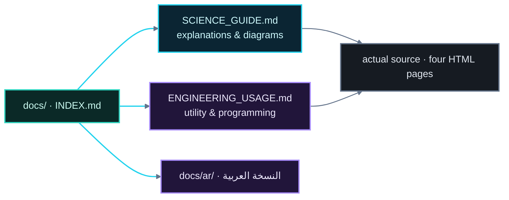

# نظام حركة المرور الذكي — فهرس التوثيق

> نقطة دخول لتوثيق المشروع.

---

## ملفات التوثيق

| الملف | الغرض | اقرأه لتتعلم |
|---|---|---|
| [`SCIENCE_GUIDE.md`](./SCIENCE_GUIDE.md) | استعراض علمي مع رسوم | ما تمثله الأنظمة، إلكترونيات الشريحتين، "FSM"، الـ"watchdog"/التبديل، نظام الاستشعار، رياضيات الموثوقية، "jitter" ومخططات العين، مسرد، ملحق معاملات كامل |
| [`ENGINEERING_USAGE.md`](./ENGINEERING_USAGE.md) | دليل الفائدة والبرمجة | لماذا المشروع مفيد (التعليم / السلامة / الأنظمة المدمجة)، بنية الكود، نمط كائن الحالة، محرك "canvas"، مخططات "SVG"، "i18n"، تصميم المحاكاة، محرك التحليلات، القيود وخارطة التوسيع |
| `ar/SCIENCE_GUIDE.md` | النسخة العربية | الترجمة الاحترافية للدليل العلمي مع إبقاء المصطلحات التقنية بالإنجليزية |
| `ar/ENGINEERING_USAGE.md` | النسخة العربية | الترجمة الاحترافية لدليل الفائدة والبرمجة |
| `ar/INDEX.md` | النسخة العربية | هذا الفهرس مترجماً |

---

## كيف تقرأ هذا التوثيق

1. **ابدأ بالدليل العلمي** لفهم كامل *ما* هو النظام و*لماذا* يتصرف كما يتصرف — كل طور
   وموقّت ومستشعر وصيغة مشروحة ومخططة. وملحقه
   [مرجع المعاملات](./SCIENCE_GUIDE.md#٧-الملحق-جدول-المعاملات) هو المصدر الواحد
   للأرقام الرئيسية.
2. **ثم اقرأ دليل الفائدة والبرمجة** لمعرفة *كيف* نُفِّذَ و*كيف* تُستخدمه / توسّعه —
   بنية الكود، العرض، "i18n"، محرك التحليلات، القيود.
3. **افتح التطبيق نفسه:** `index.html` ← `traffic_control_station.html` (شغّل الطاقة،
   بدّل الشرائح، احقن أعطالاً، جرّب الإنذار الجوي/الليل) ← `analytics.html` (شغّل
   اختبار إجهاد) ← `oscilloscope.html` (بدّل الشرائح وشاهد "jitter").
4. **بالنسبة للناطقين بالعربية:** النسخ العربية في `docs/ar/` تحافظ على المصطلحات
   التقنية الأساسية بالإنجليزية بين علامتي تنصيص ("...") حفاظاً على الدقة.

---

## خريطة المراسلات: صفحة ↔ قسم توثيق

| الصفحة | قسم الدليل العلمي | قسم الدليل البرمجي |
|---|---|---|
| `index.html` | [§٤ بنية النظام](./SCIENCE_GUIDE.md#٤-بنية-النظام) | [§٣ التخطيط والمكدس](./ENGINEERING_USAGE.md#٣-تخطيط-المستودع-ومكدس-التقنيات) |
| `traffic_control_station.html` | [§٥ FSM](./SCIENCE_GUIDE.md#٥-آلة-الحالات-المحدودة-لإشارات-المرور)، [§٦ الاستشعار](./SCIENCE_GUIDE.md#٦-النظام-الفرعي-لاستشعار-البيئة)، [§٧ Watchdog](./SCIENCE_GUIDE.md#٧-تحمّل-الأعطال-watchdog-والتكرار) | [§٥ كائن الحالة](./ENGINEERING_USAGE.md#٥-نمط-كائن-الحالة-قلب-التطبيق)، [§٦ العرض](./ENGINEERING_USAGE.md#٦-خط-أنابيب-العرض-rendering)، [§٧–٩ Canvas/SVG/i18n](./ENGINEERING_USAGE.md#٧-محرك-canvas-الراسم-الذبذبي-ومشهد-الطقس) |
| `analytics.html` | [§٨ نموذج الموثوقية](./SCIENCE_GUIDE.md#٨-نموذج-الموثوقية-العشوائي) | [§١١ محرك التحليلات](./ENGINEERING_USAGE.md#١١-محرك-التحليلات) |
| `oscilloscope.html` | [§٩ سلامة الإشارة](./SCIENCE_GUIDE.md#٩-سلامة-الإشارة-الساعة-والأطوار-والانحراف-jitter) | [§٧ محرك canvas](./ENGINEERING_USAGE.md#٧-محرك-canvas-الراسم-الذبذبي-ومشهد-الطقس)، [§١٠ المحاكاة](./ENGINEERING_USAGE.md#١٠-تصميم-المحاكاة) |

---

## حقائق سريعة

- **دورة المرور الاسمية:** 60 s — RED 30 s ← R+Y 2 s ← GREEN 25 s ← YELLOW 3 s.
- **"watchdog":** 30 s؛ يستنزف عند العطل؛ وعند 0 → التبديل الاحتياطي إلى "NE555".
- **فجوة الشريحتين:** التيار 10000 µA مقابل 0.4 µA (~25,000×)، والدقة 50 µs مقابل
  5 µs، وتحمل الضوضاء ضعيف مقابل ممتاز.
- **الساعة:** 2 Hz بفترة 0.5 s؛ "jitter" ±50 µs (NE555) مقابل ±5 µs (К561ТЛ1).

> تستخدم كل مخططات هذه الوثائق نظام ألوان دلالي واحد للمظهر الداكن (سماوي = بنية
> أساسية، بنفسجي = نماذج/ذكاء، أخضر مزرق = ثبات، كهرماني = خارجي، وردي = مسارات
> خطأ، أردوازي = بنية تحتية) مصمم لخلفية سوداء في "GitHub README".