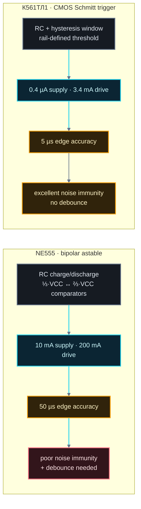
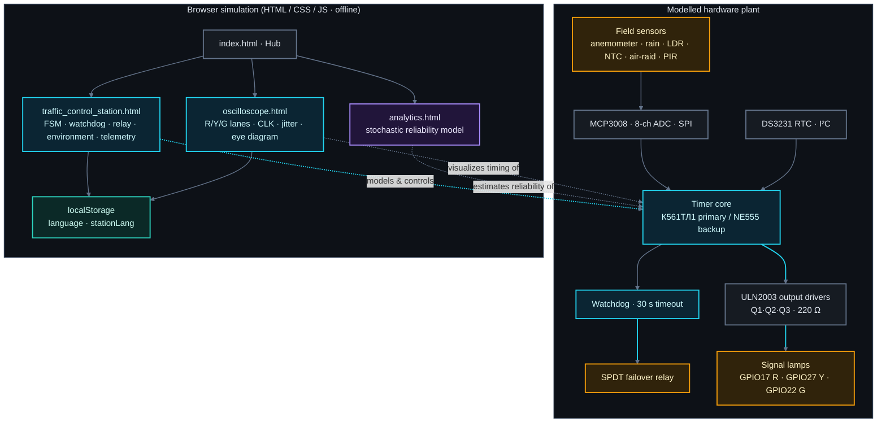
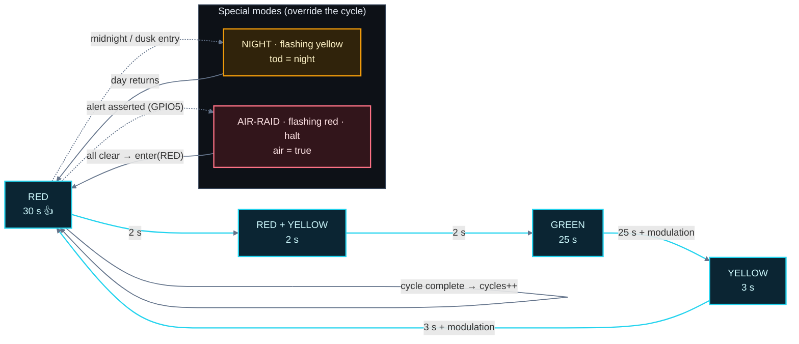
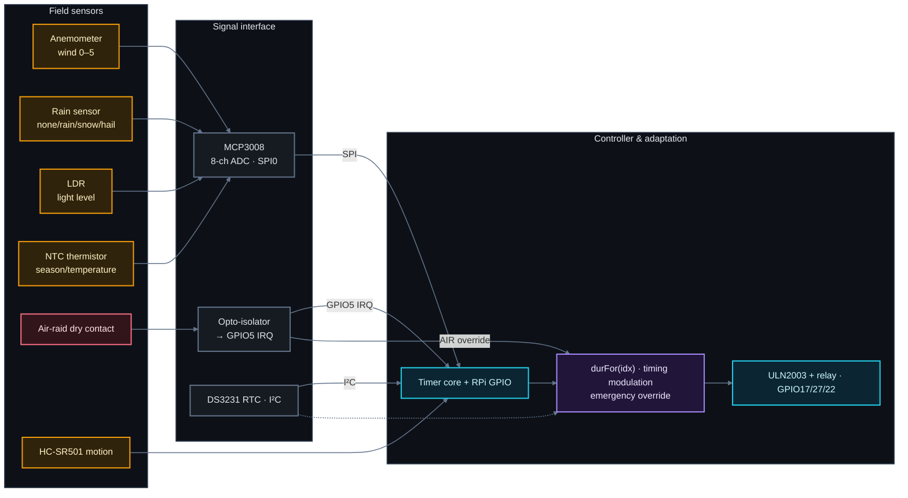
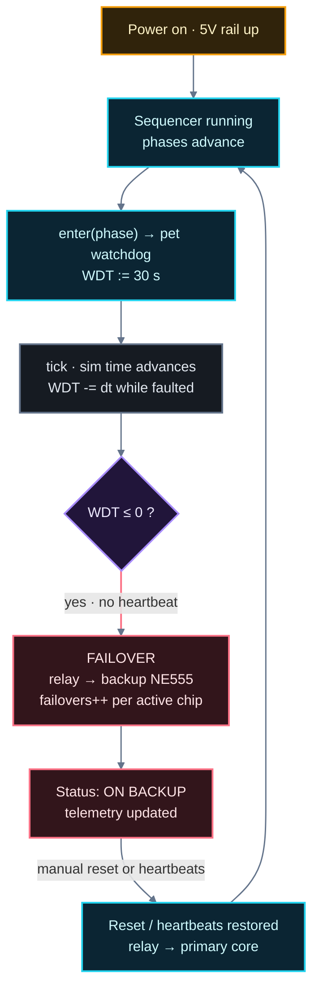
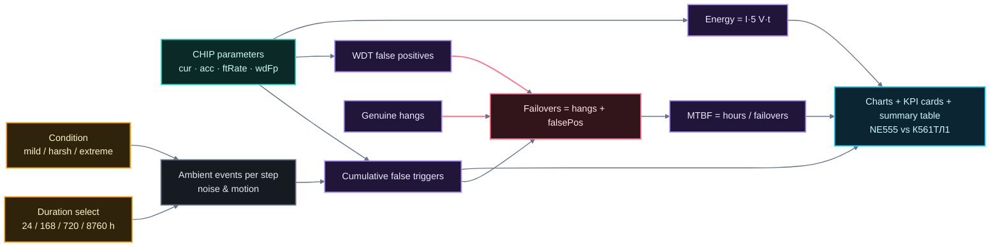
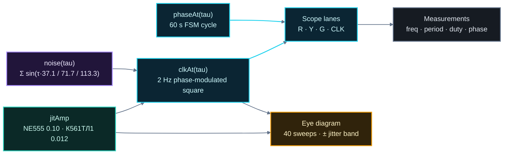

# نظام حركة المرور الذكي — دليل علمي مُعمّق

> **الاسم المختصر:** "Smart Traffic System" · **العنوان الفرعي:** "Embedded Control & Reliability Simulation"
>
> **منضدة بحثية وتعليمية قائمة على المتصفح** تحاكي وحدة تحكم بإشارات المرور مبنية حول
> تقنيتين متنافستين للموقّتات — "NE555" (نوع "bipolar") و"К561ТЛ1" (عبارة عن "CMOS Schmitt trigger")
> — وتحدّد كمية موثوقيتها ودقتها وتحملها للضوضاء داخل نموذج متكامل تفاعلي لوحدة تحكم مدمجة.
>
> جميع الرسوم البيانية في هذا المستند مصممة لتُعرض على خلفية **داكنة / شبه سوداء** لصفحة
> "GitHub README" (نظام ألوان دلالي ثابت). تُبقي تسميات المخططات على المصطلحات التقنية
> بالإنجليزية حفاظاً على الدقة والتوحيد.

---

## الفهرس

1. [ما هذا المشروع](#١-ما-هذا-المشروع)
2. [السياق الهندسي وصياغة المشكلة](#٢-السياق-الهندسي-وصياغة-المشكلة)
3. [تقنيتا الموقّت](#٣-تقنيتا-الموقّت)
4. [بنية النظام](#٤-بنية-النظام)
5. [آلة الحالات المحدودة لإشارات المرور](#٥-آلة-الحالات-المحدودة-لإشارات-المرور)
6. [النظام الفرعي لاستشعار البيئة](#٦-النظام-الفرعي-لاستشعار-البيئة)
7. [تحمّل الأعطال: "watchdog" والتكرار](#٧-تحمّل-الأعطال-watchdog-والتكرار)
8. [نموذج الموثوقية العشوائي](#٨-نموذج-الموثوقية-العشوائي)
9. [سلامة الإشارة: الساعة والأطوار والانحراف ("jitter")](#٩-سلامة-الإشارة-الساعة-والأطوار-والانحراف-jitter)
10. [الاستنتاجات](#١٠-الاستنتاجات)
11. [المسرد ("Glossary")](#١١-المسرد-glossary)
12. [الملحق: جدول المعاملات](#١٢-الملحق-جدول-المعاملات)

---

## ١. ما هذا المشروع

تطبيق ويب **مكتفٍ ذاتياً وبدون خادم ("server")** يتكون من أربع صفحات "HTML"
(`index.html` و`traffic_control_station.html` و`analytics.html` و`oscilloscope.html`).
كل صفحة عبارة عن محاكاة مستقلة مكتوبة بلغة "HTML/CSS/JS" نقية وتعمل بالكامل دون اتصال
بالإنترنت ("offline"). التطبيق ثنائي اللغة (الروسية / الإنجليزية) مع حفظ الخيار بين الصفحات
عبر "localStorage".

| الصفحة ("Page") | الدور |
|---|---|
| `index.html` | المحور / صفحة التنقل التي تصف المنضدة |
| `traffic_control_station.html` | وحدة تحكم مدمجة تفاعلية: أطوار الإشارات، و"watchdog"، والتبديل الاحتياطي ("failover")، والبيئة |
| `analytics.html` | محاكاة اختبار إجهاد للموثوقية ("MTBF"، الأخطاء، الطاقة، الدقة) |
| `oscilloscope.html` | "oscilloscope" لحظي: مسارات R/Y/G والساعة، والانحراف ("jitter")، ومخطط العين ("eye diagram") |

النظام الفيزيائي الذي تُنمذجه يتمثل في **وحدة تحكم مرورية حضرية واقعية**:

- "microcontroller" (بتقنية "Raspberry Pi GPIO") يدفع إشارات المرور عبر مشغّلات إخراج؛
- **مصدر توقيت الأطوار** (نواة المؤقّت) هو إما "К561ТЛ1" وإما "NE555"؛
- **"watchdog"** يُشرف على النواة الأساسية، وعند فقدان نبضة القلب ("heartbeat") يفعّل
  التبديل إلى النواة الاحتياطية عبر "relay"؛
- **نظام فرعي لاستشعار الحقل** (مقياس شدة الريح، مستشعر المطر، مستشعر الضوء،
  الثرمستور، جهة اتصال الإنذار الجوي، و"RTC") يكييف أزمنة الأطوار مع الطقس ووقت اليوم
  والحالات الطارئة؛
- **مستشعر الحركة "PIR"** يمكنه تمديد الطور الأخضر.

---

## ٢. السياق الهندسي وصياغة المشكلة

وحدة التحكم بإشارات المرور هي **نظام زمن حقيقي حساس للسلامة** ("safety-critical"):

- يجب أن تُنتج تسلسلاً مضموناً لا لبس فيه للأضواء (لا "أحمر + أخضر" أبداً)؛
- يجب أن تبقى صحيحة تحت تأثير الطاقة والحرارة والاهتزاز والضوضاء الكهرومغناطيسية؛
- فشل نواة التوقيت يجب ألّا يؤدي إلى تقاطع خطير — ومن هنا جاءت فكرة التكرار وإشراف "watchdog".

تصوغ المنضدة صفقة تقنية تقليدية بين تقنيتين للموقّتات:

1. **"NE555" (نوع "bipolar")** — الموقّت التماثلي الشهير: قدرة إخراج عالية، لكن تحمّل
   ضعيف نسبياً لضوضاء التغذية، ودقة حواف تبلغ ~50 ميكروثانية، وتيار خمول ~10 مللي أمبير،
   وغالباً ما يحتاج إلى إزالة الارتداد ("debounce").
2. **"К561ТЛ1" (عبر "CMOS Schmitt trigger"، من فئة "40106")** — أربع بوابات
   "Schmitt trigger" عاكسة على شريحة واحدة "DIP-14": استهلاك بالميكروأمبير (0.4 ميكروأمبير)،
   ودقة حواف ~5 ميكروثانية، وتحمّل ضوضاء جوهري بفضل "hysteresis" المدمجة، ولا حاجة
   لإزالة الارتداد؛ تخسر فقط في تيار الإخراج الخام (3.4 مللي أمبير مقابل 200 مللي أمبير).

السؤال الهندسي الذي تحاكيه كل الانحاء في هذا المشروع هو: **أي نواة أكثر موثوقية ودقة
وتحمّلاً للضوضاء كخيار لوحدة التحكم المرورية، وتحت أي ظروف يُبقي البنية الاحتياطية
التقاطع آمناً؟**

---

## ٣. تقنيتا الموقّت

### ٣-١ "NE555" — موقت ثنائي القطب (الوضع "astable")

في الوضع "astable"، يهتز موقّت "NE555" الكلاسيكي بشحن/تفريغ شبكة "RC" خارجية بين
عتبتي المقارن (⅓·VCC و⅔·VCC). دقة توقيته محدودة بما يلي:

- انزياحات إدخال "offset" و"hysteresis" في المقارنات؛
- اعتماد العتبات على جهد التغذية ودرجة الحرارة؛
- تسرب وأخطاء تناظر التبديل في الترانزستورات "bipolar".

النتائج التي يستخدمها المحاكي: **تحمّل ضعيف للضوضاء**، **دقة "50 µs"**،
**تيار تغذية "10 mA"**، الحاجة إلى "debounce"، وقدرة إخراج **"200 mA"**.

### ٣-٢ "К561ТЛ1" — عبر "CMOS Schmitt trigger"

يهتز عاكس "CMOS Schmitt trigger" بتغذية خارجه إلى مدخله عبر شبكة "RC"؛ وتكون عتبة
التبديل **جزءاً محدداً بدقة من جهد التغذية**، كما أن **نافذة "hysteresis"** الداخلية
تجعل الانتقالات محصنة ضد المدخلات البطيئة أو المزعجة. تستمد منطق "CMOS" التيار فقط أثناء
الانتقالات → استهلاك **"0.4 µA"** في حالة السكون. تلغي "hysteresis" الحاجة إلى
"debounce" خارجي وتُنتج حوافاً مستقرة بـ **~5 µs**.

### ٣-٣ المقارنة المباشرة (كما تُنمذج)

| المعامل | NE555 (bipolar) | К561ТЛ1 (CMOS) | الفائز |
|---|---|---|---|
| تيار التغذية | 10 mA (10000 µA) | 0.4 µA | К561ТЛ1 (~25,000× أقل) |
| تيار الإخراج | 200 mA | 3.4 mA | NE555 |
| دقة التبديل | 50 µs | 5 µs | К561ТЛ1 (أنقى 10 مرات) |
| تحمّل الضوضاء | ضعيف | ممتاز | К561ТЛ1 |
| "debounce" | مطلوب | غير مطلوب | К561ТЛ1 |
| معدل الإطلاق الخاطئ (نموذج) | 0.02 / حدث | 0.0 | К561ТЛ1 |
| معدل الإيجابيات الكاذبة لـ"WDT" (نموذج) | 0.05 % | 0.0 | К561ТЛ1 |

### ٣-٤ مخطط التقنيتين



---

## ٤. بنية النظام

يُظهر المستوى الأعلى **المصنع العتادي المُنمذج** على اليسار (ما تمثله المحاكاة: المستشعرات،
و"ADC"، و"RTC"، ونواة الموقّت، و"watchdog"، و"relay"، والمشغّلات، والأضواء) و**طبقة
محاكاة المتصفح** على اليمين (صفحات "HTML" الأربع). العتاد ليس حقيقياً — بل **نموذج
أمين** تمثله كل صفحة من زاوية مختلفة.



---

## ٥. آلة الحالات المحدودة لإشارات المرور

### ٥-١ التسلسل الأساسي والتواقيت

ينفّذ المتحكّم الدورة الكلاسيكية ذات الحالات الأربع (60 ثانية اسمياً، مع سرعة محاكاة
قابلة للضبط 5×–20×):

| الحالة | المفتاح ("Key") | أحمر | أصفر | أخضر | المدة الأساسية |
|---|---|---|---|---|---|
| 1 | RED | ● | | | 30 s |
| 2 | RED_YELLOW | ● | ● | | 2 s |
| 3 | GREEN | | | ● | 25 s |
| 4 | YELLOW | | ● | | 3 s |

**المتغير الثابت:** متجه الأضواء **لا يحتوي أبداً على أحمر+أخضر معاً** — والثنائي
الوحيد المسموح هو الوسط الأماني أحمر+أصفر.

### ٥-٢ مخطط الحالات



### ٥-٣ تكييف مدة الطور مع البيئة

تعدّل الدالة الزمنية `durFor(idx)` المدة الأساسية اعتماداً على حالة البيئة:

| الشرط ("Condition") | الطور | الإضافة |
|---|---|---|
| ساعة الذروة ("rush hour": صباح أو مساء) | GREEN | +10 s |
| مطر ("rain") | GREEN | +5 s |
| ثلج ("snow") | GREEN | +8 s |
| ثلج | YELLOW | +2 s |
| ثلج | RED_YELLOW | +1 s |
| برد ("hail") | YELLOW | +2 s |
| موسم الشتاء | YELLOW | +1 s |
| موسم الشتاء | RED_YELLOW | +1 s |
| حدث حركة "PIR" معلّق | GREEN | +5…15 s (5 + rand·10) |

يجعل هذا المتحكّم **متكيفاً مع البيئة**: يعطي حركة المرور المزدحمة أو الممطرة أو
الجليدية زمناً أخضر أطول، ويطيل أطوار التحذير حيث تزداد مسافات التوقف.

### ٥-٤ الحركة ("PIR")

- **حدث الحركة الصحيح** يضبط `motionPending = true`؛ وعند دخول GREEN لاحقاً، تُمدَّد
  الحالة بـ `5 + rand(0..10)` ثوانٍ، ويُمسح العلم (وتؤخذ الحركة في الحسبان مرة واحدة فقط).
- **إطلاق خاطئ** (ضوضاء/رياح) يزيد عداد `falseTriggers` المرتبط بالشريحة المقابلة بدلاً
  من ذلك (انظر "القسمين ٦ و٨").

### ٥-٥ الأوضاع الطارئة

- **الليل** (`tod === "night"`): أصفر وامض بفترة "0.5 s" — إشارة بطلب منخفض لحركة
  المرور في وقت متأخر.
- **الإنذار الجوي** (`air === true`): أحمر وامض مع توقف الحركة؛ تَنبض لافتة المشهد
  ويصبح شريط الحالة تنبيهاً متحركاً. عند رفع الإنذار يعود المتحكم إلى الحالة 0 (RED).

---

## ٦. النظام الفرعي لاستشعار البيئة

توثّق صفحة المحطة ورقة الإدخال/الإخراج (البنود **2.1–2.5**) التي تربط مستشعرات الحقل
المادية بحافلة المتحكم:

| الإشارة | المستشعر | الواجهة | تعيين "Raspberry Pi" |
|---|---|---|---|
| الرياح | مقياس شدة الريح | تماثلي ← MCP3008 CH0 | SPI0 (19/21/23/24) |
| الترسّبات | مستشعر المطر | تماثلي ← MCP3008 CH1 | SPI0 |
| الضوء / وقت اليوم | مقاومة ضوئية "LDR" | تماثلي ← MCP3008 CH2 | SPI0 |
| الموسم / درجة الحرارة | "NTC" ثرمستور | تماثلي ← MCP3008 CH3 | SPI0 |
| الوقت والتاريخ | ساعة "DS3231 RTC" | "I²C" | SDA1/SCL1 (3/5) |
| الإنذار الجوي | جهة اتصال جافة ← عزل ضوئي | إدخال منفصل + "IRQ" | GPIO5 (29) |
| الحركة | "HC-SR501" (BISS0001) | إدخال منفصل + "IRQ" | GPIO23 (16) |
| مخرجات الأضواء | "LED" + "ULN2003" Q1–Q3 | إخراج "GPIO" | GPIO17/27/22 (11/13/15) |
| تكرار النواة | ملف "relay" من نوع "SPDT" + "watchdog" | تحريك الملف | GPIO26 (37) |

### مخطط النظام الفرعي



تُرقمن الإشارات التماثلية عبر "SPI"؛ ويأتي الوقت من "RTC"؛ وخط الإنذار الجوي هو إدخال
"GPIO" معزول ضوئياً بقطع "level-triggered interrupt". يدمج المتحكم كل هذا في أزمنة
الأطوار والأوضاع الطارئة — أي **"ذكاء" النظام التكيفي**.

---

## ٧. تحمّل الأعطال: "watchdog" والتكرار

يعامل المتحكم نواة التوقيت كـ**وحدة قابلة للفشل**: حقن "تجمّد النواة" (زر العطل) يحاكي
تعليقاً، وبعده تختفي نبضة القلب ("heartbeat"). يستنزف "watchdog" من 30 ثانية إلى 0،
وعند الصفر يقوم **بتحويل "relay" تلقائياً من نوع "SPDT" إلى "NE555" الاحتياطي**
ويواصل الدورة.

في **الوضع اليدوي** يجب على المشغّل الضغط على "♥ إعادة ضبط watchdog" لإعادة تسليح
الموقّت قبل استنزافه. في **الوضع التلقائي** يعيد السيكونسر "sequencer" إضافة الطعام
للـ"watchdog" عند كل دخول طور.



المنطق الأساسي في التصميم: زوج "watchdog" + طوارئ سلبية هو الوسيلة المحددة الأدنى
والقاطعة لإبقاء متحكّم سلامة حياً — فالحتياط لا يحتاج إشرافاً مستمراً لأن فشل نبضة
قلب الأساسي نفسه هو ما يفعّله. تتيح المنضدة للمشغّل **ملاحظة هذا السيناريو بالضبط**
ومشاهدة تفاعل التليمترية معه (الحالة المعطوبة، الاستنزاف، التبديل، عدادات الشرائح).

---

## ٨. نموذج الموثوقية العشوائي

تشغّل صفحة `analytics.html` محاكاة بأسلوب "Monte-Carlo" عبر أفق زمني قابل للضبط
(24 ساعة، 168 ساعة، 720 ساعة، 8760 ساعة) وتحت ثلاثة ظروف (اعتدال / قسوة / قصوى).
تُنتج لكلتا الشريحتين "MTBF"، والإطلاقات الخاطئة، والإيجابيات الكاذبة للـ"WDT"،
والتبديلات الاحتياطية، والطاقة، والدقة — انطلاقاً من معاملات الشرائح في النموذج
الداخلي `CHIP` ("من ملف config.yaml" كما تنص الحاشية في الصفحة).

### ٨-١ معاملات الدخل

```
CHIP.NE555   { cur_uA: 10000, acc_us: 50, ftRate: 0.02, wdFp: 0.05 }   /* amber */
CHIP.K561TL1 { cur_uA: 0.4,   acc_us: 5,  ftRate: 0.0,  wdFp: 0.0 }    /* teal  */

COND.mild    { m: 0.5,  events: 24  }   /* أحداث لكل يوم، ومعامل إجهاد m */
COND.harsh   { m: 1.0,  events: 60  }
COND.extreme { m: 2.2,  events: 120 }
```

يُعيّن الأفق إلى `steps` خطوة (قابلة للتكيف بين 24 و120).

### ٨-٢ صيغ النموذج (كما نُفِّذت)

```
events    = (cond.events / 24) · stepDuration                     # أحداث ضوضاء/حركة محيطة
ftHere    = events · ftRate · cond.m · (0.7 + 0.6 · rand())      # إطلاقات خاطئة لهذه الشريحة
ftCum    += ftHere                                               # إطلاقات خاطئة تراكمية

checks    = stepDuration · 3600 / 0.5                            # فحوصات watchdog كل 0.5 ثانية
fp        = checks · (wdFp / 100) · cond.m · 0.02                # احتمال الإيجابية الكاذبة للـ WDT
falsePos += round(fp) if rand() < fp

hangs     = max(0, round(hours/2000 + rand()·1.5))               # تعليقات حقيقية للنواة
failures  = hangs
failovers = hangs + falsePos                                     # التبديل يحتاج حدثاً مثيراً

mtbf      = failovers > 0 ? hours / failovers : hours            # ساعة
energyWh  = cur_uA · 1e-6 · 5.0 · hours                          # I(A) · V(5 V) · t(h)
```

ملاحظات تفسيرية:

- **الإطلاقات الخاطئة** تتناسب مع معدل الأحداث ومعامل الإجهاد `m`، ويتضخم أثرها بمعدل
  الشريحة ضعيفة التحمّل `ftRate` (0.02 مقابل 0.0) — حيث تتراكم "NE555".
- **إيجابيات "WDT" الكاذبة** (تبديلات احتياطية عشوائية سبّبها اضطراب الضوضاء في الـ"watchdog")
  تكون غير صفرية فقط للشريحة "bipolar".
- **التعليقات الحقيقية** متساوية للشريحتين (معدل فشل عتاد المتحكم وليس خلية
  التوقيت)؛ وهذا يعزل مساهمة الشريحة نفسها.
- **"MTBF"** هي الأفق ÷ عدد التبديلات — وهي مؤشر أداء رئيسي مهيمن على الموثوقية.
- **الطاقة** تُشتق من التيار الساكن عند جهد "5 V" → تصبح ميزة "CMOS" (~25,000× أقل)
  رقماً حاسماً في المدى البعيد لأنظمة البطارية أو الطاقة الشمسية.

### ٨-٣ مخطط النموذج



### ٨-٤ دعم القرار

يعدّ الملخص المعروض عدد المقاييس البالغة سبعة التي تفوز بها كل شريحة ويُصدر توصية:
**يُوصى بـ"К561ТЛ1" كالنواة الأساسية** (يفوز بالتيار والدقة والإطلاقات الخاطئة
وإيجابيات "WDT" الكاذبة و"MTBF" والطاقة)، بينما **تبقى "NE555" كاحتياط** لقدرتها
العالية على الإخراج.

> إخلاء مسؤولية مدمج في الصفحة: "هذه محاكاة وليست قياسات على عتاد حقيقي".

---

## ٩. سلامة الإشارة: الساعة والأطوار والانحراف ("jitter")

يعرض `oscilloscope.html` أربع مسارات حية — **R** و**Y** و**G** وساعة الموقّت **CLK**
(ساعة "2 Hz" بفترة "0.5 s") — إضافة إلى **مخطط عين** مكبّر لحافة الساعة. نقطته
التعليمية كلها في جعل فارق الانحراف العشري (50 µs مقابل 5 µs) **مرئياً**.

### ٩-١ نموذج توليد الإشارة

- تعرض **عملية الطور** `phaseAt(tau)` زمن المحاكاة على دورة الـ"60 s" وتعيد الحالة
  النشطة، فتقود المسارات الرقمية R/Y/G.
- أما **عملية الساعة** `clkAt(tau)` فهي موجة مربعة بتعديل طور:

```
phase   = tau / T_period + amp · noise(tau)     # T_period = 0.5 s
noise   = sin(τ·37.1) + sin(τ·71.7) + sin(τ·113.3)   # ضوضاء زائفة حتمية
signal  = 1 if sin(phase·2π) ≥ 0 else 0
amp     = jitAmp: NE555 0.10  |  К561ТЛ1 0.012        # معيَّر للوضوح
```

الضوضاء الزائفة المكوّنة من ثلاث موجات جيبية **حتمية بالنسبة لـτ** (لا حالة خفية)،
مما يحافظ على ثباتية الموجة مع بقاء مظهرها "حياً". وتظهر التسمية المقاسة بدقة
المواصفة `±50 µs` / `±5 µs`.

### ٩-٢ الانحراف ("jitter") ومخطط العين

الانحراف هو التشتّت الإحصائي لحافة إشارة حول موضعها المثالي. **مخطط العين** يطابق
40 حافة صاعدة، كلُّها مُزاحة عشوائياً ضمن نطاق الانحراف؛ وعرض "الضباب" عند زاوية
العين هو ذروة الانحراف إلى ذروته. والعين المفتوحة جيداً هي العلامة الكلاسيكية على
موقّت/جهاز إرسال موثوق؛ "NE555" تُجمّل الحافة بوضوح مقارنةً بعين "К561ТЛ1" الضيقة.



### ٩-٣ ما يجب أن يلاحظه الطالب

1. تبديل محدد الشريحة يغيّر فقط **مسار CLK** و**عرض نطاق العين** — فتواقيت الأطوار
   متطابقة.
2. حواف "NE555" "تتعرج" بوضوح؛ وحواف "К561ТЛ1" تبدو نظيفة.
3. يكمّلها لوح القياسات: `±50 µs (high)` مقابل `±5 µs (excellent)`.

---

## ١٠. الاستنتاجات

1. **الصفقة التقنية** — يحتاج متحكّم إشارات تراعي السلامة إلى نواة توقيت *دقيقة*
   *ومستقرة تحت الضوضاء* *وقليلة الاستهلاك*؛ ولهذا الأبعاد الثلاثة تسيطر نواة "CMOS
   Schmitt trigger" "К561ТЛ1" على "NE555" من نوع "bipolar" (وحدها قدرة الإخراج
   تصبّ في صالح "555").
2. **التكرار يعمل** — "watchdog" + "relay" التبديل الاحتياطي يبقيان التقاطع في حالة
   دوران عند تعثر النواة الأساسية؛ ومسار حقن العطل في المنضدة يوضح من البداية إلى
   النهاية الاكتشاف والاستنزاف والتسليم وتقرير الحالة.
3. **تكيّف البيئة** — ربط الطقس/الوقت بأزمنة الأطوار هو طبقة "ذكاء" واقعية منخفضة
   التكلفة (لا حاجة إلى "ML") وتمثّل عرضاً جميلاً للتكيّف الحتمي.
4. **النماذج شفافة** — كل رقم في صفحة التحليلات يتبع صيغة عشوائية صريحة، مما يجعل
   المحاكاة قابلة للتصحيح، وشبيهة بإعادة الإنتاج، وأداة تعليمية نظيفة لهندسة
   الاحتمالات/الموثوقية.

---

## ١١. المسرد ("Glossary")

| المصطلح | المعنى |
|---|---|
| Astable | مذبذب حر الدوران؛ لا حالة سكون مستقرة |
| Bipolar | أسرة منطق/موقّتات قائمة على الترانزستورات (هنا "555" الكلاسيكية) |
| CMOS | أسرة منطق من أشباه الموصلات التكميلية "complementary metal–oxide–semiconductor" |
| Schmitt trigger | مقارن ذو عتبتين ("hysteresis")، محصّن ضد الحواف البطيئة/المزعجة |
| جitter | انحراف عشوائي زمني لحافة إشارة عن موضعها المثالي |
| Eye diagram | حواف إشارة مكدّسة تُستخدم لتقييم هامش الزمن/الضوضاء |
| FSM | آلة الحالات المحدودة — هنا سيكونسر أطوار إشارات المرور |
| Watchdog (WDT) | مؤقّت عتادي/برمجي يجب إعادة ضبطه دورياً ("إطعامه") |
| Failover | تحويل تلقائي إلى وحدة طوارئ بعد عطل |
| MTBF | متوسط الزمن بين الأعطال |
| ULN2003 | صفيفة "Darlington" لقيادة الـ"relay" وأحمال الأضواء |
| MCP3008 | محوّل تماثلي-رقمي "ADC" بثماني قنوات و10 بت عبر "SPI" |
| DS3231 | ساعة زمن حقيقي "RTC" بواجهة "I²C" ومذبذب معوَّض الحرارة |
| HC-SR501 / BISS0001 | وحدة مستشعر حركة "PIR" |
| LDR / NTC | مقاومة ضوئية / ثرمستور بمعامل حرارة سالب |
| Opto-isolator | مرحلة إدخال رقمية عازلة كهربائياً |

---

## ١٢. الملحق: جدول المعاملات

### الدورة الأساسية ("FSM"، اسمياً بلا تكييف)

```
RED  30 s → RED_YELLOW 2 s → GREEN 25 s → YELLOW 3 s → (cycle = 60 s)
```

### ثوابت "watchdog"

```
WDT_TIMEOUT = 30 s        # زمن التسليح بعد كل إطعام
remaining   = durFor(idx) # عداد تنازلي لكل طور (التقدّم عند ≤ 0)
```

### جدول مواصفات الشرائح (مصدر كل الأرقام المشتقة)

| الشريحة | cur | acc | الضوضاء | debounce | ftRate | wdFp | العبوة |
|---|---|---|---|---|---|---|---|
| NE555 | 10000 µA | 50 µs | ضعيفة | مطلوب | 0.02 | 0.05 % | DIP-8 |
| К561ТЛ1 | 0.4 µA | 5 µs | ممتازة | غير مطلوب | 0.0 | 0.0 % | DIP-14 |

### تواقيت "oscilloscope"

```
clkPeriod = 0.5 s  →  f = 2 Hz, duty 50 %
أساسات زمنية:  2 s / 4 s / 8 s
سرعات الأطوار:  1× / 3× / 6×
مسحات العين:  40
```